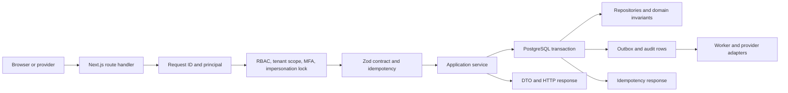
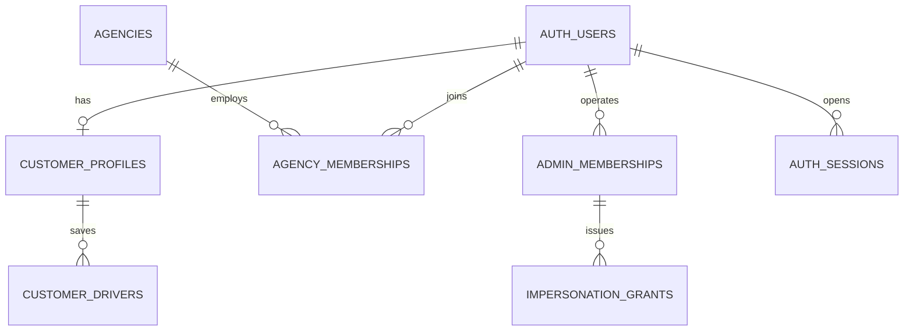
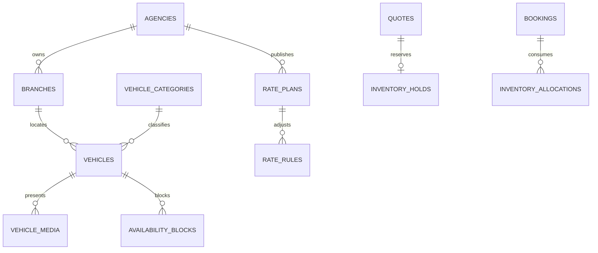
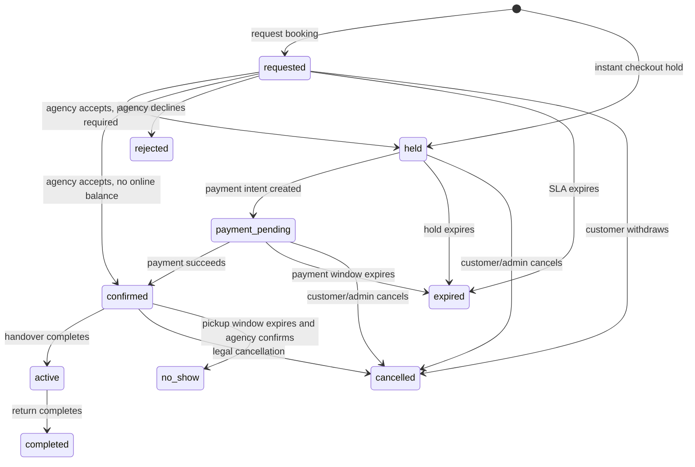
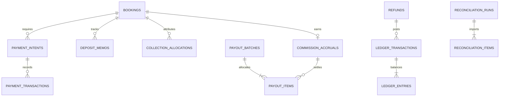
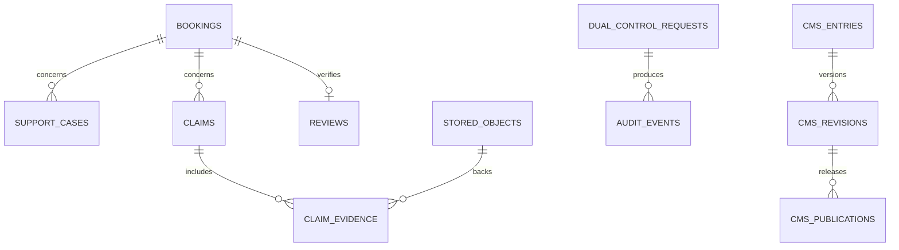
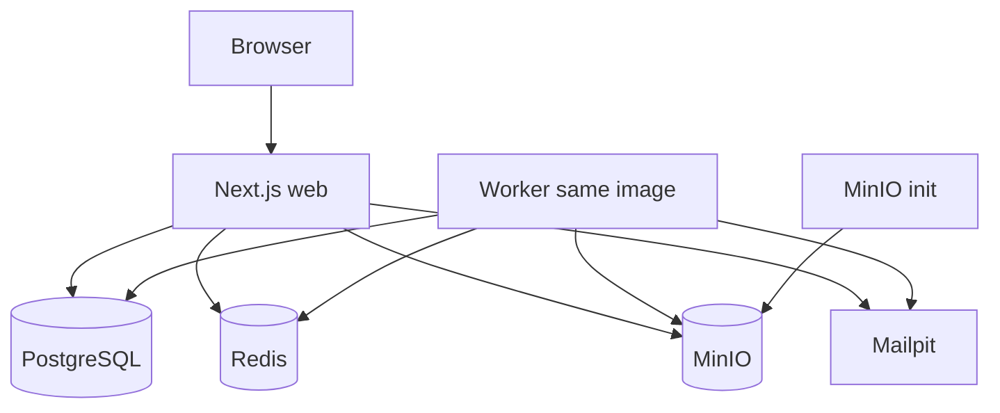

# Wheelio TN Backend and API Architecture Plan

Status: implementation contract  
Target: Next.js 16 modular monolith  
Production stack: PostgreSQL, Drizzle ORM, Better Auth, Redis, MinIO, Docker  
Languages: English (`en`) and French (`fr`) only  
Currency: Tunisian dinar (`TND`), persisted as integer millimes

## 1. Purpose, scope, and decisions

This document is the source of truth for replacing Wheelio TN's browser-only demo state with a production backend. It covers every shipped customer, agency, and admin route, the shared data model, API contracts, workflows, permissions, security controls, async processing, deployment, migration, testing, and delivery sequence.

The implementation is a modular monolith inside `wheelio-frontend`, not a separate Express service:

- Next.js Route Handlers expose `/api/v1/**`.
- Application and domain code lives under `server/modules/**`.
- PostgreSQL is the only transactional source of truth.
- Drizzle owns schema definitions and committed SQL migrations.
- Better Auth owns credentials, accounts, sessions, verification, recovery, and TOTP.
- Redis supports BullMQ, throttling, ephemeral cache, and coordination; it never owns booking, approval, or financial truth.
- MinIO provides S3-compatible public, private, and quarantine object storage.
- A worker process imports the same application services as the web process.
- English and French are the only supported locales. API locale values outside `en | fr` are rejected.
- Public IDs are opaque UUIDv7/ULID-style identifiers. Human booking references such as `WTN-881001` are unique display identifiers, never authorization credentials.

Explicit non-goals remain native admin apps, AI pricing or damage assessment, complete Tunisian tax/accounting automation, a public partner API console, and multi-country administration.

## 2. Repository evidence and current gaps

The inventory found exactly 213 `app/**/page.tsx` routes:

- 78 admin routes.
- 70 agency routes.
- 14 customer account routes.
- 13 customer booking routes.
- 38 public, auth, catalog, partner, and trip routes.

There are currently no production API route handlers, database schema, migrations, queue workers, provider adapters, or backend tests. The effective demo databases are:

- `lib/bookings.ts`: customer booking records and lifecycle.
- `lib/agency.ts`: agency tenancy, staff, branches, fleet, rates, bookings, payouts, notifications, onboarding, blocks, and policies.
- `lib/admin.ts`: staff, partner applications, agencies, bookings, cases, claims, finance, catalog moderation, CMS, analytics inputs, and audit.
- `lib/user.ts`: customer identity profile, drivers, preferences, notifications, and claimed bookings.
- `lib/admin-dual-control.ts`: second-approver requests.
- `lib/admin-agency-sync.ts`: fragile same-browser duplication between admin and agency workspaces.

The backend must remove duplicate customer/agency/admin booking copies. One canonical booking aggregate, one ledger, and projections tailored to each role replace cross-workspace synchronization.

## 3. Route-to-backend capability inventory

Every path below is a shipped page. Routes grouped on one line share the listed backend capabilities; no listed route may continue to depend on mutable demo state after cutover.

### 3.1 Public, auth, catalog, and partner routes (38)

- `/`: featured locations, vehicle categories, agency highlights, search bootstrap, CMS snippets.
- `/about`, `/how-it-works`, `/terms`, `/privacy`, `/cookies`, `/cancellation-policy`: localized published CMS/legal revisions.
- `/faq`, `/help`, `/help/[article]`, `/guides`, `/guides/[slug]`: localized CMS collections and article detail.
- `/contact`: public support enquiry with category, contact details, consent and anti-abuse controls.
- `/reviews`: moderated public review feed and aggregate ratings.
- `/locations`, `/locations/[slug]`: published locations, branch coverage, pickup guidance, and SEO content.
- `/agencies`, `/agencies/[slug]`: verified public agencies, quality summary, branch coverage, fleet categories, and reviews.
- `/cars/types`, `/cars/types/[type]`, `/cars/[id]`: category taxonomy, offer/vehicle detail, features, media, policy and availability summary.
- `/search`: availability search, filters, sorting, sponsored disclosure, quote creation, and rate/deposit comparison.
- `/checkout`: quote validation, contact/driver details, extras, payment mode, contract snapshot/signature, inventory hold, and booking creation.
- `/login`, `/signup`, `/logout`, `/forgot-password`, `/reset-password`, `/auth/magic`, `/auth/verify`: customer credential, magic-link, verification, recovery, and session flows.
- `/partners`, `/partners/faq`: localized partner marketing, commission explanation, eligibility, and contract content.
- `/partners/join`, `/partners/join/success`: partner application draft/submission, compliance upload intents, consent, and receipt.
- `/trips`, `/trips/[id]`, `/trips/calendar`: authenticated booking list/detail redirects and calendar feed.
- `/dev/emails`: development-only template catalog; disabled outside local/test environments.

Primary APIs: public content, catalog, search, quotes, bookings, auth, partner applications, reviews, and calendar export.

### 3.2 Customer account routes (14)

- `/account`: profile summary, next trip, saved drivers, preferences, and account alerts.
- `/account/welcome`: first-run profile completion and guest-booking claim.
- `/account/profile`: legal/preferred name, phone, birth date, nationality, residence, address, city.
- `/account/security`: password, magic-link preference, active sessions, and session revocation.
- `/account/preferences`: `en | fr`, theme, usual pickup, age band, extras interests, and marketing consent.
- `/account/notifications`, `/account/notifications/settings`: notification inbox/read state and per-event email/SMS choices.
- `/account/drivers`, `/account/drivers/new`, `/account/drivers/[id]`: saved driver CRUD, one primary driver, licence metadata and private licence files.
- `/account/payments`: payment/refund timeline and saved payment-token references; never raw card data.
- `/account/saved`: saved offer/search CRUD.
- `/account/claim`: secure guest-booking claim after reference plus verified email challenge.
- `/account/privacy`: export request, consent history, deletion request, legal hold status.

Primary APIs: customer profile, drivers, preferences, notification settings, sessions, saved items, privacy requests, and booking claims.

### 3.3 Customer booking routes (13)

- `/bookings/find`: rate-limited guest booking lookup followed by email OTP/magic-link challenge.
- `/bookings/[id]`: canonical status, trip, agency, vehicle/category, price, payment, next action, and timeline.
- `/bookings/[id]/confirmation`: confirmation receipt and booking/contract summary.
- `/bookings/[id]/schedule`: pickup/return scheduling changes allowed by policy.
- `/bookings/[id]/modify`: quote-backed date, location, driver, and extras change request.
- `/bookings/[id]/payments`: payment intents, captured amounts, desk balance, refunds, and deposit memo.
- `/bookings/[id]/documents`: contract, voucher, invoice/receipt, licence requirements, signed downloads.
- `/bookings/[id]/voucher`: immutable voucher and QR verification.
- `/bookings/[id]/pickup`: pickup instructions, flight details, checklist progress, and contact actions.
- `/bookings/[id]/return`: return instructions, fuel/mileage checklist, and issue escalation.
- `/bookings/[id]/messages`: booking-scoped conversation and attachments.
- `/bookings/[id]/claim`: customer incident/claim creation and evidence upload.
- `/bookings/[id]/review`: one verified review after completion, with edit window and moderation.

Primary APIs: booking queries/commands, modifications, payments, documents, checklists, messaging, claims, and reviews.

### 3.4 Agency routes (70)

Authentication and shell:

- `/agency/login`, `/agency/logout`, `/agency/forgot-password`, `/agency/reset-password`, `/agency/invite/[token]`.
- `/agency`: tenant dashboard, queues, SLA, pickups, cars out, unread messages, quality and finance summary.
- `/agency/inbox`, `/agency/notifications`, `/agency/notifications/settings`.
- `/agency/help`, `/agency/help/[article]`.

Onboarding:

- `/agency/onboarding`.
- `/agency/onboarding/profile`, `/documents`, `/branch`, `/fleet`, `/rates`, `/policies`, `/review`.
- These routes save resumable steps, validate prerequisites, upload compliance files, and submit the agency for admin review.

Bookings and operations:

- `/agency/bookings`, `/agency/bookings/calendar`, `/agency/bookings/[id]`.
- `/agency/bookings/[id]/accept`: accept with category/vehicle allocation or reject with reason before SLA.
- `/agency/bookings/[id]/prepare`: assign vehicle and mark preparation checklist ready.
- `/agency/bookings/[id]/handover`: verify driver/documents, capture desk payment and deposit memo, record condition/signatures, transition to active.
- `/agency/bookings/[id]/return`: record return time, mileage, fuel, condition, charges/disputes, deposit release memo, transition to completed or claim.
- `/agency/bookings/[id]/documents`, `/messages`, `/finance`, `/issue`.

Branches and delivery:

- `/agency/branches`, `/agency/branches/new`, `/agency/branches/[branchId]`.
- `/agency/branches/[branchId]/hours`, `/agency/branches/[branchId]/delivery`.
- Capabilities include contacts, address/geocode, timezone, pickup methods, weekly/exception hours, delivery zones, fees, and branch visibility.

Fleet, categories, and availability:

- `/agency/fleet`, `/agency/fleet/new`, `/agency/fleet/categories`.
- `/agency/fleet/[vehicleId]`, `/photos`, `/availability`.
- Capabilities include physical vehicle CRUD, plate/VIN uniqueness, category mapping, specs, status, branch assignment, pool membership, media ordering, maintenance, and availability blocks.

Calendar:

- `/agency/calendar`, `/agency/calendar/blocks`.
- Unified bookings, holds, maintenance, owner-use, cleaning, and conflict detection.

Rates, fees, and preview:

- `/agency/rates`, `/agency/rates/new`, `/agency/rates/[planId]`, `/agency/rates/fees`, `/agency/rates/preview`.
- Net daily rates, minimum days, weekday/weekend/season rules, mandatory fees, extras, protection, derived listed prices, and quote simulation.

Policies:

- `/agency/policies`, `/agency/policies/cancellation`, `/mileage`, `/fuel`, `/deposit`, `/drivers`, `/protection`.
- Versioned policy editing with future effective dates; existing bookings retain snapshots.

Finance:

- `/agency/payouts`, `/agency/payouts/[payoutId]`, `/agency/ledger`, `/agency/invoices`.
- Read-only settlement truth, payout items, commission invoices, downloadable files, and dispute creation. Agency staff cannot directly mark payouts paid.

Team and settings:

- `/agency/team`, `/agency/team/invite`, `/agency/team/[memberId]`.
- `/agency/settings`, `/agency/settings/public-profile`, `/agency/settings/booking-mode`, `/agency/settings/contract`, `/agency/settings/security`.
- Membership lifecycle, branch scope, role changes, public profile, Instant/request mode, contract acceptance, MFA, sessions, and bank-change request.

Quality and reports:

- `/agency/reviews`, `/agency/reports`, `/agency/reports/quality`.
- Review responses, acceptance/response/SLA/cancellation metrics, fleet utilization, revenue, commission, payouts, and CSV export.

### 3.5 Admin routes (78)

Authentication and control plane:

- `/admin/login`, `/admin/logout`, `/admin/forgot-password`, `/admin/reset-password`, `/admin/mfa`.
- `/admin`, `/admin/search`, `/admin/notifications`, `/admin/audit`, `/admin/sla`.
- Global queues/search, notification inbox, immutable audit explorer, SLA rules and breach operations.

Partner applications and agencies:

- `/admin/applications`, `/admin/applications/[id]`.
- `/admin/agencies`, `/admin/agencies/[agencyId]`.
- `/admin/agencies/[agencyId]/branches`, `/fleet`, `/rates`, `/documents`, `/contract`, `/staff`, `/quality`, `/payouts`, `/notes`.
- Application assignment, document review, approve/reject, agency creation, verification, pause/suspend, public visibility, Instant graduation, commission tier, branch/fleet/rate inspection, contract versions, staff support, quality interventions, payouts, and private notes.

Bookings:

- `/admin/bookings`, `/admin/bookings/[id]`, `/messages`, `/money`, `/timeline`, `/override`.
- Cross-tenant lookup, privileged read, support messages, payment/ledger allocation, full event timeline, and controlled status override/force cancellation.

Customers:

- `/admin/customers`, `/admin/customers/[userId]`, `/bookings`, `/risk`.
- Profile and booking support view, risk flags, privacy status, read-only impersonation grant, and account restriction.

Cases and claims:

- `/admin/cases`, `/admin/cases/new`, `/admin/cases/[caseId]`.
- `/admin/claims`, `/admin/claims/[claimId]`.
- Assignment, priority, tags, thread, internal notes, evidence, decisions, deposit-at-stake memo, rent impact, refund/adjustment initiation, SLA and closure.

Finance:

- `/admin/finance`, `/ledger`, `/commissions`, `/invoices`.
- `/admin/finance/payouts`, `/new`, `/[payoutId]`.
- `/admin/finance/refunds`, `/[refundId]`.
- `/admin/finance/reconciliation`.
- Append-only ledger, commission accruals, invoice lifecycle, payout batch generation/hold/approval/release, refund allocation, provider reconciliation, export and exception handling.

Catalog and growth:

- `/admin/vehicles`, `/admin/vehicles/[vehicleId]`: flags, category mapping, photo quality, forced hiding.
- `/admin/categories`: canonical taxonomy and agency aliases.
- `/admin/fees-catalog`: platform fee and extra taxonomy.
- `/admin/locations`, `/new`, `/[slug]`: localized location publication and agency links.
- `/admin/promotions`, `/new`, `/[promoId]`: code/featured campaigns, eligibility, budget/redemption limits and lifecycle.

Content:

- `/admin/content`, `/guides`, `/guides/[slug]`, `/help`, `/faq`, `/legal`.
- `/admin/content/reviews`, `/reviews/[reviewId]`.
- EN/FR draft, preview, revision, schedule/publish/unpublish; review moderation and reason.

People, configuration, and development:

- `/admin/staff`, `/admin/staff/invite`, `/admin/staff/[staffId]`.
- `/admin/settings`, `/admin/settings/security`, `/admin/feature-flags`.
- `/admin/dev/emails`.
- Admin membership lifecycle, roles, MFA/session policy, dual-control threshold, SLA, take rates, feature rollout, and local-only email previews.

Analytics:

- `/admin/analytics`, `/demand`, `/supply`, `/quality`, `/finance`.
- Pre-aggregated KPIs and exports for search-to-book conversion, location/category demand, supply/availability/utilization, partner quality/SLA, GMV/commission/refunds/payouts/reconciliation. Analytics is read-only and excludes security deposits from GMV.

## 4. Modular-monolith architecture

### 4.1 Module boundaries

The modules are:

- `identity`: Better Auth integration, sessions, MFA, invitations, effective principal, impersonation.
- `customers`: profiles, drivers, preferences, consent, saved items, privacy requests.
- `partners`: applications, onboarding, application documents and review.
- `agencies`: tenant profile, memberships, public profile, verification, contract and banking-change requests.
- `branches`: contacts, hours, pickup/delivery configuration and locations.
- `fleet`: categories, physical vehicles, media, maintenance and pools.
- `availability`: holds, allocations, blocks and overlap prevention.
- `pricing`: plans, rules, fees, extras, protections, promotions, quotes and immutable snapshots.
- `bookings`: booking aggregate, participants, status history, modifications, checklists, handover and return.
- `documents`: object metadata, signed uploads/downloads, contracts, vouchers, PDFs and retention.
- `messaging`: conversations, messages, attachments and unread state.
- `notifications`: templates, preferences, in-app notifications and delivery attempts.
- `reviews-content`: reviews, moderation, CMS, localization and publication.
- `support`: cases, claims, evidence, assignments and decisions.
- `finance`: payments, refunds, ledger, commission, invoices, payouts and reconciliation.
- `analytics`: projections, rollups and export jobs.
- `admin`: feature flags, SLA settings, categories, dual control and privileged orchestration.
- `audit`: immutable audit events, outbox, idempotency records and webhook receipts.

No module imports another module's Drizzle tables or repository. Cross-module work uses exported application interfaces. Commands spanning modules are coordinated by an application service and a single PostgreSQL transaction where consistency is required.

### 4.2 Repository layout

```text
wheelio-frontend/
  app/
    api/
      auth/[...all]/route.ts
      v1/
        public/**/route.ts
        account/**/route.ts
        bookings/**/route.ts
        agency/**/route.ts
        admin/**/route.ts
        uploads/**/route.ts
        webhooks/**/route.ts
        health/live/route.ts
        health/ready/route.ts
  server/
    core/
      auth/ database/ errors/ http/ observability/
      queue/ rate-limit/ storage/ transactions/
    modules/
      identity/ customers/ partners/ agencies/ branches/
      fleet/ availability/ pricing/ bookings/ documents/
      messaging/ notifications/ reviews-content/ support/
      finance/ analytics/ admin/ audit/
    contracts/
      common.ts money.ts pagination.ts ids.ts
    providers/
      payments/ email/ sms/ maps/ storage/
    worker/
      index.ts processors/ schedules/
  db/
    schema/*.ts
    relations.ts
    seed/
  drizzle/
    migrations/
  tests/
    unit/ integration/ contract/ concurrency/ security/ e2e/
  drizzle.config.ts
  Dockerfile
  compose.yaml
```

Each module contains `domain/`, `application/`, `infrastructure/`, `contracts/`, and an explicit `index.ts` public boundary.

### 4.3 Request and write flow



Route handlers contain no business rules. A mutating request succeeds only after the domain change, ledger effects, audit event, and outbox rows commit atomically.

## 5. Production data model

### 5.1 Global database rules

- Primary keys: UUIDv7 or ULID stored as native UUID where possible.
- External references: separately unique, non-sequential values (`WTN-*`, invoice number, payout number).
- Timestamps: `timestamptz`, UTC at rest; business timezone defaults to `Africa/Tunis`.
- Mutable aggregates: integer `version NOT NULL DEFAULT 1`; updates compare expected version.
- Money: signed `bigint` millimes and `currency char(3) CHECK (currency = 'TND')`.
- Rates: integer basis points. `12% = 1200`; never persisted as float.
- Localized content: one stable entity plus translation rows keyed by `(entity_id, locale)`, with `locale IN ('en','fr')`.
- Soft deletion is limited to recoverable profile/catalog records. Booking, payment, ledger, contract, audit, approval and compliance history is never overwritten or hard-deleted through product APIs.
- Every tenant-owned row carries `agency_id`; repositories require an agency scope. Do not rely on UI filtering.
- PII fields are separated where useful, encrypted when high risk, and omitted from analytics projections.

### 5.2 Identity, customer, and tenancy entities

Better Auth tables:

- `auth_users`: identity id, canonical email, email verified time, name, image, created/updated.
- `auth_accounts`: provider, provider account, password credential metadata.
- `auth_sessions`: token hash, user, expiry, IP, user agent, assurance level, revoked time.
- `auth_verifications`: email verification, magic link and recovery token hashes with purpose and expiry.
- `auth_two_factors`: encrypted TOTP secret, recovery code hashes and enrollment time.

Wheelio identity tables:

- `customer_profiles`: user id, legal name, preferred name, normalized/encrypted phone, birth date, nationality, residence, address, city, preferred locale, theme, onboarding time, risk status, version.
- `customer_drivers`: customer, full name, birth date/age band, country, encrypted licence number, normalized licence hash, category, expiry, primary flag, notes, version, deleted time. Partial unique index ensures one active primary driver per customer.
- `notification_preferences`: principal type/id, event key, channel, enabled, locale, unique tuple.
- `consent_events`: subject, consent type/version, granted/revoked, source, IP, time; append-only.
- `saved_searches`, `saved_offers`: customer, normalized search/offer snapshot, created time.
- `privacy_requests`: export/deletion type, status, due time, legal hold reason, completion artifact.

Agency and admin tenancy:

- `agency_memberships`: agency, user, role, status, optional branch scope, invited by, accepted/disabled time, version.
- `admin_memberships`: user, role, status, invited by, MFA required, version.
- `staff_invitations`: portal, tenant, email, intended role/scope, token hash, expiry, accepted/revoked time.
- `impersonation_grants`: admin actor, target type/id, reason, ticket, allowed read scopes, issued/expiry/stopped time. Grants are always read-only and short-lived.



### 5.3 Partners, agencies, branches, and compliance

- `partner_applications`: status, trade/legal name, tax id hash and encrypted value, city, email, phone, fleet estimate, branches planned, applicant user, assignee, source, submitted/withdrawn/decided times, decision reason, version.
- `application_documents`: application, document kind, stored object, status, expiry, reviewer, decision reason, reviewed time, version.
- `application_notes`: application, author, internal body, created/edited time.
- `agencies`: slug, trade/legal name, encrypted tax id, contact details, verification status, commission tier, booking mode, Instant enabled, public visibility, locale support, quality values, version, suspended time.
- `agency_profiles_i18n`: agency, locale, public name, bio and pickup description.
- `agency_verification_history`: old/new state, reason, actor, source approval, time.
- `agency_contract_versions`: template version, rendered object, hash, accepted by, accepted time, effective dates.
- `agency_bank_accounts`: encrypted IBAN, lookup fingerprint, last four, holder, verification status, effective dates. Changes create approval requests; previous records remain.
- `agency_notes`: private admin notes with author and edit history.
- `branches`: agency, location, name, contact, address, lat/lng, timezone, active/public flags, version.
- `branch_pickup_methods`: branch, method (`counter | meet_greet | delivery`), active, instructions.
- `branch_hours`: branch, weekday, opens/closes, closed flag.
- `branch_hour_exceptions`: date/range, special hours, reason.
- `delivery_zones`: branch, polygon/radius/postcodes, fee millimes, minimum rental, active.

### 5.4 Fleet, rates, and availability

- `vehicle_categories`: canonical code, localized label, sort order, active.
- `agency_category_aliases`: agency text/remote code to canonical category.
- `vehicle_pools`: agency, branch, category, name, allocation mode, active.
- `vehicles`: agency, branch, pool, category, plate ciphertext and unique normalized hash, optional VIN ciphertext/hash, make/model/year, transmission, fuel, seats, bags, status, visibility, version.
- `vehicle_features`: vehicle, feature code.
- `vehicle_media`: vehicle, stored object, kind, sort order, approved/public times, moderation state.
- `maintenance_records`: vehicle, type, notes, odometer, status, scheduled/completed times, objects.
- `availability_blocks`: agency, vehicle or pool, `tstzrange`, kind, reason, source, version.
- `inventory_holds`: quote, booking candidate, vehicle or pool, `tstzrange`, expires, status, idempotency key.
- `inventory_allocations`: booking, physical vehicle or pool/category, `tstzrange`, status, allocated by/time, version.
- `rate_plans`: agency, branch/category scope, name, net daily millimes, minimum/maximum days, active/effective dates, version.
- `rate_rules`: plan, rule kind, date/day ranges, priority, adjustment type/value, minimum stay, stack policy.
- `mandatory_fees`: agency or platform, code, calculation mode, amount/rate, taxable flag, effective dates.
- `extras`: agency, code, localized name, price mode/amount, inventory limit, active.
- `protection_options`: agency, localized content, price mode, exclusions and effective dates.
- `policy_versions`: agency, policy kind, localized content, structured rule JSON, effective dates, published time.
- `promotions`: code, type, value, eligibility JSON, budget/redemption limits, per-customer limit, effective dates, status, version.

Physical vehicle conflicts are prevented in PostgreSQL, not Redis:

```sql
ALTER TABLE inventory_allocations
ADD CONSTRAINT no_overlapping_vehicle_allocations
EXCLUDE USING gist (
  vehicle_id WITH =,
  reserved_range WITH &&
)
WHERE (vehicle_id IS NOT NULL AND status IN ('held','confirmed','active'));
```

Pool/category inventory is protected in the booking transaction by locking the pool inventory row and checking capacity across overlapping ranges. The implementation must include concurrency tests with many simultaneous holds.



### 5.5 Quotes, bookings, contracts, and communication

- `search_sessions`: anonymous/customer id, normalized query, locale, attribution, expiry.
- `quotes`: search session, agency/branch, category/vehicle, pickup/return, confirmation mode, status, expires, currency, version.
- `quote_snapshots`: immutable JSON plus normalized money columns for rental, mandatory fees, extras, discount, commissionable amount, agency net, commission, online due, desk due, and deposit memo.
- `bookings`: reference, customer/guest identity, agency, branch, status, confirmation mode, payment mode, pickup/return, SLA expiry, accepted/cancelled/completed times, current version.
- `booking_snapshots`: immutable accepted quote, agency/branch/vehicle/category, policies, rate rules, commission agreement, customer-facing labels, locale and hash.
- `booking_drivers`: immutable booking-time driver data; separate from mutable saved drivers.
- `booking_extras`: snapshotted extra, quantity and price.
- `booking_status_history`: from/to state, actor/effective actor, reason/code, source, at, request id.
- `booking_modification_requests`: proposed snapshot/delta, price difference, status, expiry, actor and decision.
- `booking_checklists`: phase (`pickup | preparation | handover | return`), item, value, actor, time.
- `handover_records`: odometer, fuel, condition, driver/doc checks, desk collection, deposit memo, signatures and object references.
- `return_records`: return time, odometer, fuel, condition, proposed charges, deposit release memo, signatures and object references.
- `contracts`: booking, version, locale, immutable payload, SHA-256, customer/agency signature metadata, issued/effective time, rendered objects.
- `vouchers`: booking, version, token hash/QR, rendered object, revoked time.
- `conversations`, `conversation_participants`, `messages`, `message_attachments`, `message_reads`.



An override never skips validation silently. It records the original/current state, target state, reason, ticket, step-up session, and dual-control request when required.

### 5.6 Finance and ledger

- `payment_intents`: booking, provider, provider reference, purpose, amount, status, expires, idempotency.
- `payment_transactions`: intent, provider transaction, type (`authorization | capture | void | charge | refund`), amount, status, provider times, raw receipt reference.
- `deposit_memos`: booking, holder (`agency | provider`), amount, method, status (`expected | held | partially_released | released | claimed | disputed`), external reference. These rows are operational memos/liabilities and never ledger revenue.
- `refunds`: booking, reason, customer amount, agency clawback, Wheelio absorbed amount, status, requested/approved/sent/failed times, provider reference, version.
- `ledger_accounts`: code, owner type/id, currency and class.
- `ledger_transactions`: type, booking/refund/payout/reconciliation reference, effective time, immutable description and idempotency key.
- `ledger_entries`: transaction, account, signed debit/credit millimes. Entries for one transaction must net to zero.
- `collection_allocations`: booking, collector (`wheelio | agency`), channel, gross amount, refund allocation and reconciliation status. This is the source for determining which party currently holds customer funds.
- `commission_accruals`: booking, agreement snapshot, commissionable amount, rate basis points, amount, status.
- `payout_batches`: agency, period, status, totals, bank account version, hold reason, version.
- `payout_items`: payout, booking/collection/accrual/refund/adjustment source, signed amount and allocation.
- `invoices`: agency, period, invoice number, commission amount, status, issue/due/paid times, immutable PDF.
- `reconciliation_runs`: provider, statement period/object, status, counts/totals.
- `reconciliation_items`: external row, normalized amount/reference, matched transaction, match method/confidence, exception state and resolution.
- `manual_adjustments`: ledger transaction, reason/ticket, requested by, approval; always dual-controlled above configured threshold.

Money invariants:

```text
1 TND = 1000 millimes
commissionable = mandatory rental + mandatory fees - eligible discounts
GMV = commissionable
commission = round_half_up(commissionable * rate_bps / 10_000)
agency_net = commissionable - commission
customer_total = commissionable + noncommissionable extras where configured
online_collected + desk_due + refunded = customer_total, adjusted by explicit ledger entries
agency_settlement_position = wheelio_collected_for_agency - commission - agency_clawbacks + wheelio_funded_adjustments
positive agency_settlement_position = Wheelio payout liability
negative agency_settlement_position = agency payable/commission receivable, carried to invoice or future offset
security deposit is never GMV, commission, revenue, payout, or invoice turnover
```

All booking, commission, policy and quote snapshots are immutable. Corrective finance operations append reversing/adjusting transactions; they do not edit historical entries.

`agency_net` is a commercial price split, not automatically the payout amount. For a pay-at-agency booking, the agency already holds the customer funds and normally owes Wheelio the commission; paying `agency_net` again would overpay the agency. Payouts contain only positive, reconciled Wheelio-to-agency settlement positions. Negative positions become commission receivables/invoices or explicit future-period offsets.



### 5.7 Support, content, audit, and platform entities

- `support_cases`: subject, status, priority, booking/agency/customer, channel, owner, SLA times, version.
- `case_messages`, `case_notes`, `case_tags`, `case_assignments`.
- `claims`: booking, type, source, status, deposit-at-stake memo, rent impact, decision, owner, SLA, version.
- `claim_evidence`, `claim_decisions`, `claim_adjustments`.
- `reviews`: booking unique, customer, agency, rating, body, status, submitted/edited times, version.
- `review_moderation`: review, decision, reason, actor, at.
- `review_responses`: review, agency, body, status, at.
- `cms_entries`: kind, slug, status, current revision, scheduled publish, version.
- `cms_revisions`: entry, revision, locale, title, body/structured content, author, created time, hash.
- `cms_publications`: entry/revision/locale, publish/unpublish time, actor.
- `cms_publication_approvals`: legal revision, counsel/reference evidence, requester, distinct approver, status and decision time.
- `feature_flags`: key, description, enabled, environment, targeting JSON, version.
- `dual_control_requests`: action kind, target, canonical payload/hash, requester, approver, status, expiry, reason, decided time, execution result.
- `audit_events`: actor, effective actor, action, resource, tenant, reason/ticket, request id, IP/user agent, before/after digest, metadata, at. Append-only and partitioned by time.
- `outbox_events`: aggregate, event type/version, payload, occurred time, publish attempts, published/dead-letter times.
- `idempotency_keys`: principal/scope/key, request hash, state, status code, response body, resource id, expiry.
- `webhook_receipts`: provider, provider event id, signature status, payload object/hash, processing status and attempts.
- `stored_objects`: bucket/key, owner, purpose, classification, MIME, size, checksum, scan status, retention/legal hold and deletion times.



### 5.8 Retention and deletion

- Auth verification tokens: delete after expiry plus 30 days.
- Sessions: retain security metadata 180 days after revocation, then aggregate/anonymize.
- Abandoned quarantine uploads: delete after 24 hours; rejected malware samples according to security policy.
- Search sessions: raw anonymous data 90 days, then aggregate.
- Messages/support evidence: policy-configured, default 3 years after case closure.
- Licence/compliance objects: retain only while operational/legal need exists; expiry and review jobs are mandatory.
- Bookings, contracts, invoices, ledger, payouts and reconciliation: retain according to Tunisian legal/accounting advice; proposed baseline 10 years.
- Audit events for privileged and financial actions: proposed baseline 10 years in immutable storage.
- Customer deletion anonymizes profile and marketing data but preserves legally required booking/finance records under pseudonymous identity.
- Legal hold blocks object and row deletion and is itself audited.

Legal retention periods, invoice requirements, electronic-signature validity, and provider settlement rules require Tunisian counsel/accountant approval before production launch.

## 6. API standards and contracts

### 6.1 Protocol conventions

- Base path: `/api/v1`; breaking DTO changes require `/api/v2`.
- JSON uses `camelCase`; IDs are strings; timestamps are ISO 8601 UTC.
- Money DTO: `{ "amountMillimes": "440125", "currency": "TND" }`. Millimes are strings in JSON to avoid JavaScript integer loss.
- Successful singleton: `{ "data": {...}, "meta": { "requestId": "..." } }`.
- Successful collection: `{ "data": [...], "page": { "nextCursor": "...", "hasMore": true }, "meta": {...} }`.
- Create returns `201` and `Location`; accepted async exports return `202`; delete with no body returns `204`.
- Cursor pagination: `limit` default 25, maximum 100, opaque `after`. Page/order columns plus id form a stable cursor.
- Filters and sorts are endpoint-specific allowlists. Unknown filters return `VALIDATION_ERROR`; no raw column names or SQL fragments are accepted.
- Search text is normalized, length-limited, and escaped. PII global search is admin-only and audited.
- `X-Request-Id` may be supplied and is always returned; invalid values are replaced.
- `Accept-Language: en|fr`; fallback is principal preference then `en`.
- Mutable resource responses include `ETag: "v{version}"`. Commands require `If-Match` or `expectedVersion`.
- `Idempotency-Key` is mandatory on commands that create bookings, holds, payments, refunds, payouts, messages with attachments, uploads, or irreversible actions. Same key plus different request hash returns `409 IDEMPOTENCY_KEY_REUSED`.
- Cookie-authenticated writes require same-origin CSRF protection. Provider webhooks use raw-body signature verification instead.
- Sensitive commands require a recent `amr`/assurance claim (`mfa`, maximum age 10 minutes) and may require dual control.

Error envelope:

```json
{
  "error": {
    "code": "BOOKING_VERSION_CONFLICT",
    "message": "The booking changed. Reload and try again.",
    "details": { "currentVersion": 8 },
    "requestId": "req_01..."
  }
}
```

Standard error codes:

- `AUTH_REQUIRED`, `EMAIL_VERIFICATION_REQUIRED`, `MFA_REQUIRED`, `STEP_UP_REQUIRED`.
- `FORBIDDEN`, `TENANT_SCOPE_VIOLATION`, `IMPERSONATION_READ_ONLY`.
- `NOT_FOUND`, `GONE`, `VALIDATION_ERROR`, `UNSUPPORTED_LOCALE`.
- `VERSION_CONFLICT`, `ILLEGAL_STATE_TRANSITION`, `INVENTORY_CONFLICT`, `HOLD_EXPIRED`.
- `PAYMENT_REQUIRED`, `PAYMENT_PROVIDER_ERROR`, `REFUND_LIMIT_EXCEEDED`.
- `DUAL_CONTROL_REQUIRED`, `SELF_APPROVAL_FORBIDDEN`, `APPROVAL_EXPIRED`.
- `IDEMPOTENCY_KEY_REUSED`, `RATE_LIMITED`, `UPLOAD_REJECTED`.
- `PROVIDER_SIGNATURE_INVALID`, `TEMPORARY_UNAVAILABLE`, `INTERNAL_ERROR`.

Default endpoint behavior used by the catalog:

- Read: `200`, authenticated limit 300/minute, no audit unless PII/privileged.
- Collection: cursor pagination with explicit filters.
- Create: `201`, Zod validation, transaction, idempotency where noted.
- Update/command: `200`, expected version, transaction, domain history, audit and outbox.
- Validation errors: `422`; unauthenticated `401`; unauthorized `403`; missing `404`; conflict `409`; rate limit `429`.
- Every mutation records actor, effective actor, tenant, request id and reason where required.
- `E:` lists emitted outbox events. `A:` lists extra audit/assurance. `L:` overrides the default rate limit.

### 6.2 Role and permission model

Customer:

- Read and change own profile, drivers, preferences, notifications, saved items and privacy requests.
- Read own/claimed bookings; command only transitions permitted by booking policy.
- Guest access is limited to a one-time challenge grant scoped to one booking.

Agency roles:

- `owner`: all agency operations, team and settings; MFA for bank, security and contract actions.
- `manager`: bookings, branches, fleet, rates, policies, reports and routine settings; no ownership transfer or bank activation.
- `agent`: booking acceptance, preparation, handover, return, messages and operational documents.
- `fleet`: vehicles, photos, maintenance, availability and preparation; no customer finance or payouts.
- `accountant`: booking finance read, ledger, invoices, payouts and finance exports; no fleet or operational status writes.
- Branch-scoped memberships can act only on assigned branches.

Admin roles:

- `super`: all permissions, mandatory MFA; still cannot self-approve dual-control requests.
- `partner_success`: applications/agencies/quality/contracts, non-financial notes and support.
- `support`: customers/bookings/cases/claims/messages and policy-limited adjustments.
- `finance`: ledger/refunds/invoices/payouts/reconciliation, mandatory MFA.
- `content`: CMS, locations, taxonomy and review moderation.
- `readonly_analyst`: analytics and redacted operational reads only.

### 6.3 Better Auth and identity endpoints

Better Auth owns `/api/auth/**`:

- `POST /api/auth/sign-up/email`: public; email/password/name/locale; creates unverified identity and verification event. `E: identity.registered, verification.requested`. `L: 5/hour/IP`.
- `POST /api/auth/sign-in/email`: public; credentials; rotates session after success. `A: security login event`. `L: 5 failures/15 minutes/account+IP`.
- `POST /api/auth/sign-in/magic-link`: public; email/portal/return URL; always non-enumerating. `E: magic_link.requested`. `L: 3/hour/account, 10/hour/IP`.
- `GET /api/auth/verify-email`: token; one-use verification and session rotation. `E: identity.email_verified`.
- `POST /api/auth/forget-password`: public; non-enumerating recovery request. `L: 3/hour/account`.
- `POST /api/auth/reset-password`: token/new password; revoke other sessions. `E: password.changed, sessions.revoked`.
- `POST /api/auth/sign-out`: authenticated; revoke current session.
- `GET /api/auth/get-session`: current effective identity, portal memberships and assurance.
- Better Auth two-factor routes: enroll/verify/disable TOTP and recovery codes. Enrollment/disable require password re-auth; disable is audited.

Wheelio identity extensions:

- `GET /api/v1/me`: authenticated; profile, memberships, portal choices, locale and assurance.
- `GET /api/v1/me/sessions`: authenticated; list own active sessions with current marker.
- `DELETE /api/v1/me/sessions/{sessionId}`: owner; revoke one session. `E: session.revoked`.
- `POST /api/v1/me/sessions/revoke-others`: owner + recent auth; revoke all except current.
- `POST /api/v1/invitations/{token}/accept`: authenticated matching email; role and tenant are server-derived. Transaction activates membership and consumes token. `E: membership.activated`.

### 6.4 Public, CMS, catalog, search, and quote APIs

- `GET /api/v1/public/bootstrap`: public; locale. Returns featured locations/categories/agencies, CMS snippets and safe feature flags. Cache 5 minutes.
- `GET /api/v1/public/cms/{kind}`: public; `kind=guide|help|faq|legal`, locale, cursor. Published revisions only.
- `GET /api/v1/public/cms/{kind}/{slug}`: public; locale. Returns published revision, canonical/alternate locale and ETag.
- `GET /api/v1/public/locations`: public; query/city/cursor/sort. Published locations only.
- `GET /api/v1/public/locations/{slug}`: public; localized location, branches, guidance and aggregate supply.
- `GET /api/v1/public/agencies`: public; location/category/minRating/cursor.
- `GET /api/v1/public/agencies/{slug}`: public; only live/public agency; localized profile, quality aggregates, branches, category supply and visible reviews.
- `GET /api/v1/public/categories`: public; localized canonical categories and attributes.
- `GET /api/v1/public/categories/{code}`: public; category content and currently searchable supply.
- `GET /api/v1/public/offers/{offerId}`: public; offer token/id, trip context. Revalidates visibility and returns quoteable details; an offer is not a locked price.
- `GET /api/v1/public/reviews`: public; agency/location/rating/cursor; visible reviews only.
- `GET /api/v1/public/partner-content`: public; localized program, tier and contract-marketing content.
- `POST /api/v1/public/contact-enquiries`: public; name, email/phone, category, booking reference when relevant, message, locale and consent. Creates a support case without revealing booking existence. `E: case.created, support_notification.requested`; idempotency required. `L: 5/hour/IP+contact`.

Search:

- `POST /api/v1/search`: public; pickup/dropoff location, ISO local dates/times, timezone, age band, filters, sort and cursor. Validates return after pickup, supported location, lead time and max duration. Reads effective rates/policies and availability projection; creates/updates search session, not a hold. Returns normalized query, facets and offer tokens. `L: 60/minute/IP`. Sponsored results carry explicit disclosure.
- `GET /api/v1/search/{searchId}`: public with signed search token or owner; retrieves normalized query and current result page.
- `POST /api/v1/quotes`: public/session; offer token, selected extras, driver age/country and payment mode. Transaction re-prices from effective rules, stores immutable quote snapshot and expiry. No inventory allocation yet. `E: quote.created`. `L: 30/10 minutes/session`.
- `GET /api/v1/quotes/{quoteId}`: signed quote token/owner; current snapshot, expiry and availability hint.
- `POST /api/v1/quotes/{quoteId}/holds`: signed quote token/owner; expected quote version. Transaction checks inventory, creates expiring hold under exclusion/capacity protection. `E: inventory.hold_created`; idempotency required. Returns `201`, `409 INVENTORY_CONFLICT`, or `410 HOLD_EXPIRED`. `L: 10/10 minutes/session`.
- `DELETE /api/v1/quotes/{quoteId}/hold`: holder; idempotently releases active hold. `E: inventory.hold_released`.

### 6.5 Partner application APIs

- `POST /api/v1/partner-applications`: public or customer; contact, legal/trade name, tax id, city, fleet/branch estimates, locale and consent version. Creates draft and applicant grant. `E: partner_application.created`; idempotency required. `L: 3/day/email+IP`.
- `GET /api/v1/partner-applications/{id}`: applicant or partner admin; redacted according to role.
- `PATCH /api/v1/partner-applications/{id}`: applicant while draft/docs-requested; allowlisted fields, expected version. `E: partner_application.updated`.
- `POST /api/v1/partner-applications/{id}/submission`: applicant; validates required fields, documents and consent; transition draft to new/in-review. `E: partner_application.submitted, admin_queue.changed`; idempotency required.
- `POST /api/v1/partner-applications/{id}/withdrawal`: applicant before decision; reason. `E: partner_application.withdrawn`.
- `GET /api/v1/partner-applications/{id}/documents`: applicant/admin.
- `POST /api/v1/partner-applications/{id}/documents`: applicant; finalized upload object id and document kind; transaction attaches only clean object owned by applicant. `E: application_document.attached`.
- `DELETE /api/v1/partner-applications/{id}/documents/{documentId}`: applicant while replaceable; soft removal and object retention schedule.

### 6.6 Customer account APIs

- `GET /api/v1/account/profile`: customer; own profile and consent summary.
- `PATCH /api/v1/account/profile`: customer; names, phone, birth date, nationality/residence/address/city; expected version. Phone changes require verification workflow. `E: customer.profile_updated`.
- `GET /api/v1/account/preferences`: customer.
- `PATCH /api/v1/account/preferences`: customer; locale `en|fr`, theme, usual pickup, age band, extras interests, marketing choice. Marketing change appends consent event. `E: customer.preferences_updated`.
- `GET /api/v1/account/drivers`: customer; masked licence numbers by default.
- `POST /api/v1/account/drivers`: customer; driver fields and optional clean licence object. Validates age, future expiry and unique active licence fingerprint. `E: customer.driver_created`; idempotency required.
- `GET /api/v1/account/drivers/{driverId}`: owner; full detail requires recent auth when licence unmask is supported.
- `PATCH /api/v1/account/drivers/{driverId}`: owner; expected version. Setting primary clears prior primary in one transaction. `E: customer.driver_updated`.
- `DELETE /api/v1/account/drivers/{driverId}`: owner; blocks deletion when required by an active booking; soft deletes otherwise. `E: customer.driver_deleted`.
- `GET /api/v1/account/notifications`: customer; type/read filter/cursor.
- `POST /api/v1/account/notifications/read`: customer; notification ids or `allBefore`; bulk mark read.
- `GET /api/v1/account/notification-preferences`: customer.
- `PUT /api/v1/account/notification-preferences`: customer; complete allowlisted event/channel matrix. Mandatory transactional/legal email cannot be disabled.
- `GET /api/v1/account/saved-searches`, `POST /api/v1/account/saved-searches`, `DELETE /api/v1/account/saved-searches/{id}`: customer; normalized query snapshots.
- `GET /api/v1/account/saved-offers`, `POST /api/v1/account/saved-offers`, `DELETE /api/v1/account/saved-offers/{id}`: customer; offer identity is revalidated when displayed.
- `GET /api/v1/account/payment-activity`: customer; booking/payment/refund summaries; no PAN.
- `POST /api/v1/account/booking-claims/challenges`: customer; reference and matching email; sends one-time challenge without disclosing match. `L: 5/15 minutes/IP+identity`.
- `POST /api/v1/account/booking-claims`: customer + challenge; transaction attaches eligible guest booking, rejects mismatched existing owner. `E: booking.claimed`; idempotency required.
- `POST /api/v1/account/privacy/exports`: customer + recent auth; creates export job. `E: privacy.export_requested`; returns `202`.
- `GET /api/v1/account/privacy/requests/{id}`: owner; status and signed artifact when ready.
- `POST /api/v1/account/privacy/deletion`: customer + recent auth; reason and confirmation. Creates reviewable request, revokes marketing and future sessions according to policy. `E: privacy.deletion_requested`.

### 6.7 Booking, payment, document, message, claim, and review APIs

Booking creation and lookup:

- `POST /api/v1/bookings`: customer/guest with quote and active hold; contact, immutable driver input, extras confirmation, payment mode, customer signature metadata, consent/policy versions. Transaction locks hold, revalidates quote, creates booking/snapshot/history/contract source, converts hold allocation, and creates payment intent when needed. `E: booking.created, contract.render_requested, booking.requested|booking.payment_required`; idempotency required. Returns `201`, or `409/410`.
- `POST /api/v1/booking-access/challenges`: guest; reference plus email; non-enumerating challenge. `L: 5/15 minutes`.
- `POST /api/v1/booking-access/grants`: guest; challenge code. Returns short-lived HTTP-only grant scoped to one booking.
- `GET /api/v1/bookings`: customer; status/time filters/cursor, own/claimed bookings.
- `GET /api/v1/bookings/{bookingId}`: customer owner, agency tenant staff, or permitted admin; role-specific DTO and field redaction. Agency/admin privileged reads are audited when sensitive fields are returned.
- `GET /api/v1/bookings/{bookingId}/timeline`: authorized participant; customer receives public events, agency/admin receive allowed operational events.

Customer commands:

- `POST /api/v1/bookings/{id}/cancellation-quotes`: customer; computes policy outcome, refund estimate and expiry without mutation.
- `POST /api/v1/bookings/{id}/cancellation`: customer; cancellation quote id, reason, expected version. Transaction validates status/window, transitions, releases inventory, creates refund request if paid. `E: booking.cancelled, inventory.released, refund.requested`; idempotency required.
- `POST /api/v1/bookings/{id}/modification-quotes`: customer; requested dates/location/driver/extras. Re-prices and checks inventory.
- `POST /api/v1/bookings/{id}/modifications`: customer; modification quote, expected version. Creates request or applies atomically according to agency confirmation rules. `E: booking.modification_requested|booking.modified`; idempotency required.
- `POST /api/v1/bookings/{id}/schedule`: customer where policy allows; flight number, landing time, contact timing. `E: booking.schedule_updated`.
- `GET /api/v1/bookings/{id}/checklists/{phase}`: participant; phase-specific items.
- `PUT /api/v1/bookings/{id}/checklists/{phase}`: customer/agency according to item ownership; complete allowlisted answers, expected version. `E: booking.checklist_updated`.

Payments and deposits:

- `GET /api/v1/bookings/{id}/payments`: authorized participant; role-specific payment timeline, balances and deposit memo.
- `POST /api/v1/bookings/{id}/payment-intents`: customer; amount/purpose/payment method token, expected version. Server derives payable amount. `E: payment.intent_created`; idempotency required. `L: 10/10 minutes`.
- `POST /api/v1/bookings/{id}/payment-confirmation`: customer; provider return token only; server verifies provider state. Never trusts client success. `E: payment.verification_requested`.
- `GET /api/v1/bookings/{id}/refunds`: customer, agency finance or admin finance with allocation redaction.

Documents:

- `GET /api/v1/bookings/{id}/documents`: participant; list purpose, version, availability and download permission.
- `GET /api/v1/bookings/{id}/documents/{documentId}/download`: participant with record-level permission; returns 60-second signed URL and audits sensitive download.
- `POST /api/v1/bookings/{id}/documents`: authorized customer/agency; attach finalized clean object for an allowed document kind. `E: booking.document_attached`.
- `GET /api/v1/bookings/{id}/voucher`: participant; current immutable voucher metadata and signed download.
- `GET /api/v1/contracts/{contractId}/verify`: public with non-secret contract id/hash prefix; returns integrity status and minimal booking facts, never PII.

Messaging:

- `GET /api/v1/bookings/{id}/messages`: booking participant/support; cursor ordered by `(createdAt,id)`.
- `POST /api/v1/bookings/{id}/messages`: customer/agency/support; body 1..4000 and clean attachment ids. Transaction creates message and unread markers. `E: message.created, notification.requested`; idempotency required. `L: 30/minute`.
- `POST /api/v1/bookings/{id}/messages/read`: participant; last-read message id.

Claims and reviews:

- `POST /api/v1/bookings/{id}/claims`: customer or agency; type, description, requested resolution, evidence object ids. Valid only in configured lifecycle window. `E: claim.opened, admin_queue.changed`; idempotency required.
- `GET /api/v1/bookings/{id}/claims`: participants; redacted decisions/evidence.
- `GET /api/v1/claims/{claimId}`: claimant/respondent/admin with role view.
- `POST /api/v1/claims/{claimId}/evidence`: claimant/respondent; clean object and description before evidence deadline. `E: claim.evidence_added`.
- `POST /api/v1/bookings/{id}/reviews`: customer; completed booking, rating 1..5, bounded text; one review per booking. `E: review.submitted`; idempotency required.
- `PATCH /api/v1/reviews/{reviewId}`: author within edit window; expected version. Moderation state may return to pending. `E: review.edited`.

### 6.8 Agency portal APIs

All `/api/v1/agency/**` routes require an active agency membership and derive `agencyId` from the server-selected context. A client-supplied tenant id is ignored or rejected. Verification state may restrict writes while preserving document/onboarding access.

Dashboard, onboarding, and profile:

- `GET /api/v1/agency/dashboard`: all agency roles; branch filter. Returns queues, expiring SLA, pickups, cars out, unread messages, fleet/quality/finance summaries appropriate to role.
- `GET /api/v1/agency/onboarding`: active applicant/member; step state, validation errors and review feedback.
- `PUT /api/v1/agency/onboarding/{step}`: owner/manager during onboarding; `step=profile|branch|fleet|rates|policies|booking-mode`; typed full step payload and expected version. Transaction updates domain records and completion state. `E: agency.onboarding_step_completed`.
- `POST /api/v1/agency/onboarding/submission`: owner; validates mandatory steps/documents and moves verification `draft -> review`. `E: agency.submitted_for_review, admin_queue.changed`; idempotency required.
- `GET /api/v1/agency/profile`: member; internal profile.
- `PATCH /api/v1/agency/profile`: owner/manager; non-sensitive contact fields, expected version. Tax/legal name changes create review request rather than silently replacing verified values.
- `GET /api/v1/agency/public-profile`: member.
- `PATCH /api/v1/agency/public-profile`: owner/manager; localized EN/FR bio/name, media and visibility request. `E: agency.public_profile_updated`.
- `GET /api/v1/agency/contract`: member; current accepted and pending contract versions.
- `POST /api/v1/agency/contract/acceptance`: owner + MFA; contract version and explicit consent. Stores immutable acceptance. `E: agency.contract_accepted`; idempotency required.
- `POST /api/v1/agency/bank-change-requests`: owner + MFA; finalized bank proof and bank details. Encrypts IBAN and creates dual-controlled admin review; does not activate immediately. `E: agency.bank_change_requested`; idempotency required.

Agency bookings:

- `GET /api/v1/agency/bookings`: owner/manager/agent/accountant; branch/status/date/search/cursor. Fleet role gets operationally redacted list.
- `GET /api/v1/agency/bookings/calendar`: operational roles; time range/branch/vehicle; booking allocations and safe customer labels.
- `GET /api/v1/agency/bookings/{id}`: permitted member in branch scope; finance fields only for owner/manager/accountant.
- `POST /api/v1/agency/bookings/{id}/acceptance`: owner/manager/agent; vehicle or pool allocation, optional note, expected version. Transaction locks booking/inventory, rejects expired SLA/conflicts, transitions to held/payment-pending/confirmed, records allocation. `E: booking.accepted, inventory.allocated, customer_notification.requested`; idempotency required.
- `POST /api/v1/agency/bookings/{id}/rejection`: owner/manager/agent; standardized reason and optional note, expected version. Releases hold/allocation and initiates refund/void if needed. `E: booking.rejected, inventory.released, refund.requested`; idempotency required.
- `PUT /api/v1/agency/bookings/{id}/preparation`: owner/manager/agent/fleet; assigned vehicle and checklist. When complete marks ready. `E: booking.preparation_updated`.
- `POST /api/v1/agency/bookings/{id}/handover`: owner/manager/agent; driver/doc verification, odometer/fuel/condition, desk collection, deposit memo, signatures and photos. Transaction validates confirmed/ready state and allocated vehicle, posts permitted ledger memo/collection, sets vehicle on-rent, transitions active. `E: booking.handover_completed, vehicle.status_changed, receipt.render_requested`; idempotency required.
- `POST /api/v1/agency/bookings/{id}/return`: owner/manager/agent; return facts, condition/evidence, proposed charges and deposit action. Transaction sets vehicle ready/maintenance, transitions completed or opens claim/charge review, posts explicit collections. `E: booking.return_completed, vehicle.status_changed, claim.opened?, deposit.release_recorded`; idempotency required.
- `POST /api/v1/agency/bookings/{id}/no-show`: owner/manager/agent after grace window; evidence/reason. May require support review when money is retained. `E: booking.no_show_recorded`.
- `POST /api/v1/agency/bookings/{id}/issues`: member; type, description, severity, evidence. Creates support case/claim. `E: booking.issue_reported`.
- `GET /api/v1/agency/bookings/{id}/finance`: owner/manager/accountant; immutable price/commission/payment/ledger allocation.

Branches:

- `GET /api/v1/agency/branches`: member; active/all filter.
- `POST /api/v1/agency/branches`: owner/manager; name, contact, address/geocode, methods; unique logical branch validation. `E: branch.created`; idempotency required.
- `GET /api/v1/agency/branches/{id}`: member.
- `PATCH /api/v1/agency/branches/{id}`: owner/manager; expected version. Public address/geocode changes can require moderation. `E: branch.updated`.
- `DELETE /api/v1/agency/branches/{id}`: owner; only if no future bookings/vehicles or after reassignment; soft close. `E: branch.closed`.
- `PUT /api/v1/agency/branches/{id}/hours`: owner/manager; full weekly hours and dated exceptions. Validates non-overlap and timezone. `E: branch.hours_updated`.
- `PUT /api/v1/agency/branches/{id}/delivery-zones`: owner/manager; zones/fees/minimums; geometry validation. `E: branch.delivery_updated`.

Fleet and availability:

- `GET /api/v1/agency/vehicle-categories`: member; canonical mappings and agency aliases.
- `PUT /api/v1/agency/vehicle-category-aliases`: owner/manager/fleet; alias mappings. `E: fleet.category_mapping_updated`.
- `GET /api/v1/agency/vehicles`: member; branch/status/category/search/cursor.
- `POST /api/v1/agency/vehicles`: owner/manager/fleet; plate, optional VIN, specs, category, branch/pool and status. Unique normalized plate/VIN within legal scope. `E: vehicle.created`; idempotency required.
- `GET /api/v1/agency/vehicles/{id}`: member.
- `PATCH /api/v1/agency/vehicles/{id}`: owner/manager/fleet; expected version. Plate/category changes are audited and may trigger moderation. `E: vehicle.updated`.
- `POST /api/v1/agency/vehicles/{id}/status`: owner/manager/fleet; target/reason/expected version. Cannot mark ready while active allocation or unresolved safety maintenance exists. `E: vehicle.status_changed`.
- `GET /api/v1/agency/vehicles/{id}/media`: member.
- `POST /api/v1/agency/vehicles/{id}/media`: owner/manager/fleet; clean finalized public-media candidate and sort order. Creates pending moderation/public derivative. `E: vehicle.media_attached, media.derivative_requested`.
- `PATCH /api/v1/agency/vehicles/{id}/media/{mediaId}`: owner/manager/fleet; sort/caption.
- `DELETE /api/v1/agency/vehicles/{id}/media/{mediaId}`: owner/manager/fleet; blocks removal below required count while public.
- `GET /api/v1/agency/availability`: operational roles; range/branch/vehicle/pool and conflicts.
- `POST /api/v1/agency/availability-blocks`: owner/manager/fleet; target, start/end, kind and reason. Transaction uses overlap policy; may flag rather than override booking. `E: availability.block_created`; idempotency required.
- `PATCH /api/v1/agency/availability-blocks/{id}`: owner/manager/fleet; expected version.
- `DELETE /api/v1/agency/availability-blocks/{id}`: owner/manager/fleet; soft cancel. `E: availability.block_removed`.
- `POST /api/v1/agency/maintenance-records`: owner/manager/fleet; vehicle/type/schedule/notes/object ids. Optionally creates block atomically. `E: maintenance.created`.

Rates, fees, policies, and booking mode:

- `GET /api/v1/agency/rate-plans`: member; effective/status/category/branch filters.
- `POST /api/v1/agency/rate-plans`: owner/manager; plan scope, net rate millimes, stay limits, rules/effective date. Validates nonnegative rates and rule ambiguity. `E: rate_plan.created`; idempotency required.
- `GET /api/v1/agency/rate-plans/{id}`: member.
- `PATCH /api/v1/agency/rate-plans/{id}`: owner/manager; future-effective revision, expected version. Existing quote/booking snapshots stay unchanged. `E: rate_plan.revised`.
- `POST /api/v1/agency/rate-plans/{id}/publication`: owner/manager; effective date. Requires verified agency, mapped category, valid policies and supply. `E: rate_plan.published`.
- `GET /api/v1/agency/fees`, `PUT /api/v1/agency/fees`: owner/manager; versioned fee/extras/protection configuration. `E: agency.fees_revised`.
- `POST /api/v1/agency/rate-preview`: member; dates/branch/category/extras/promo. Pure calculation returning net, listed, commission, customer total and deposit separately. `L: 60/minute`.
- `GET /api/v1/agency/policies`: member.
- `PUT /api/v1/agency/policies/{kind}`: owner/manager; `kind=cancellation|mileage|fuel|deposit|drivers|protection`, EN/FR content, structured rules and future effective date. `E: agency.policy_revised`.
- `POST /api/v1/agency/booking-mode-change-requests`: owner + MFA for Instant; requested mode and attestations. Request mode may downgrade immediately; Instant enablement requires quality/admin approval. `E: agency.booking_mode_requested`.

Team, security, notifications, and help:

- `GET /api/v1/agency/members`: owner/manager; manager cannot edit owner or privilege above self.
- `POST /api/v1/agency/invitations`: owner; email, role, branch scope. `E: agency.invitation_created, email.requested`; idempotency required. `L: 20/day/agency`.
- `POST /api/v1/agency/invitations/{id}/resend`: owner; cooldown enforced.
- `DELETE /api/v1/agency/invitations/{id}`: owner; revoke pending invitation.
- `PATCH /api/v1/agency/members/{id}`: owner; role/scope/status, expected version. Cannot disable last active owner. `E: agency.membership_updated, sessions.revoked?`.
- `GET /api/v1/agency/sessions`: current member; own sessions, owner may view redacted agency security summary.
- `POST /api/v1/agency/sessions/revoke`: self or owner with MFA according to target; revokes selected session.
- `GET /api/v1/agency/notifications`, `POST /api/v1/agency/notifications/read`, `GET/PUT /api/v1/agency/notification-preferences`: same patterns as customer, with role-aware mandatory events.
- `GET /api/v1/agency/help`, `GET /api/v1/agency/help/{slug}`: active member; published agency-audience CMS.

Finance, reviews, and reports:

- `GET /api/v1/agency/ledger`: owner/manager/accountant; date/type/booking/cursor; read-only balanced entries projected to agency view.
- `GET /api/v1/agency/payouts`: owner/manager/accountant; status/period/cursor.
- `GET /api/v1/agency/payouts/{id}`: finance-capable role; items, holds and bank last four.
- `POST /api/v1/agency/payouts/{id}/disputes`: owner/accountant; item ids/reason/evidence. Does not mutate payout directly. `E: payout.disputed, admin_queue.changed`.
- `GET /api/v1/agency/invoices`: owner/manager/accountant; period/status/cursor.
- `GET /api/v1/agency/invoices/{id}/download`: finance-capable role; short signed PDF URL, audited.
- `GET /api/v1/agency/reviews`: member; status/rating/cursor.
- `POST /api/v1/agency/reviews/{id}/response`: owner/manager; one bounded response, moderated. `E: review.response_submitted`.
- `GET /api/v1/agency/reports/overview`, `/quality`: owner/manager/accountant, with finance redaction for non-finance roles; range/branch.
- `POST /api/v1/agency/reports/exports`: permitted role; report/range/format. `E: analytics.export_requested`; returns `202`.

### 6.9 Admin control-plane APIs

All admin mutations require an active admin membership. Sensitive PII reads and every write are audited. `readonly_analyst` receives aggregates/redacted DTOs only.

Dashboard, search, SLA, notifications, audit:

- `GET /api/v1/admin/dashboard`: admin; role-specific queue and KPI summaries.
- `GET /api/v1/admin/search`: non-analyst admin; query/types/cursor. Searches booking reference, agency, customer contact, plate and case; raw query and result access are audited. `L: 60/minute`.
- `GET /api/v1/admin/notifications`, `POST /api/v1/admin/notifications/read`.
- `GET /api/v1/admin/audit-events`: super or scoped security/finance admin; actor/action/resource/date/request id/cursor. Export requires MFA and reason.
- `GET /api/v1/admin/sla-policies`: super/partner/support read.
- `PUT /api/v1/admin/sla-policies/{kind}`: super + MFA; structured duration/escalations/effective date, expected version. `E: sla.policy_revised`.
- `GET /api/v1/admin/sla-breaches`: support/partner/super; status/owner/type/cursor.
- `POST /api/v1/admin/sla-breaches/{id}/acknowledgement`: support/partner/super; owner/note. `E: sla.breach_acknowledged`.

Applications:

- `GET /api/v1/admin/partner-applications`: partner/super; status/assignee/city/search/cursor.
- `GET /api/v1/admin/partner-applications/{id}`: partner/super; application, notes, document decisions and timeline.
- `POST /api/v1/admin/partner-applications/{id}/assignment`: partner/super; staff id and expected version. `E: partner_application.assigned`.
- `POST /api/v1/admin/partner-applications/{id}/document-decisions`: partner/super; document id, approve/reject/expired, reason. `E: application_document.reviewed, applicant_notification.requested`.
- `POST /api/v1/admin/partner-applications/{id}/documents-request`: partner/super; required kinds/message/deadline. Transition to docs-requested. `E: application.documents_requested`.
- `POST /api/v1/admin/partner-applications/{id}/approval`: partner/super + recent MFA when configured; expected version, initial tier and booking mode. Transaction validates documents, creates agency/membership/onboarding state and decides application. `E: partner_application.approved, agency.created, invitation.created`; idempotency required.
- `POST /api/v1/admin/partner-applications/{id}/rejection`: partner/super; reason code/message, expected version. `E: partner_application.rejected`.
- `POST /api/v1/admin/partner-applications/{id}/notes`: partner/super; internal body. Audited.

Agencies:

- `GET /api/v1/admin/agencies`: partner/super/support/finance; role-redacted filters/search/cursor.
- `GET /api/v1/admin/agencies/{id}`: permitted admin; overview and scoped tabs.
- `GET /api/v1/admin/agencies/{id}/branches|fleet|rates|documents|contract|members|quality|payouts|notes`: role-specific subresources matching shipped tabs.
- `POST /api/v1/admin/agencies/{id}/verification-transitions`: partner/super; target, reason/ticket, expected version. `live|paused` may execute; `suspended` always creates dual control. `E: agency.verification_changed|dual_control.requested`.
- `POST /api/v1/admin/agencies/{id}/instant-decisions`: partner/super; enable/disable, quality evidence and reason. Enabling requires configured thresholds and may require dual control. `E: agency.instant_changed`.
- `POST /api/v1/admin/agencies/{id}/tier-change-requests`: partner/super + MFA; tier, rate basis points, effective date, reason. Always dual-controlled. `E: dual_control.requested`.
- `POST /api/v1/admin/agencies/{id}/bank-change-decisions`: finance/super + MFA; request id, decision, reason. Approval requires second approver and activates version only after execution. `E: dual_control.requested`.
- `POST /api/v1/admin/agencies/{id}/public-visibility`: partner/super; visible and reason; cannot publish non-live agency.
- `POST /api/v1/admin/agencies/{id}/documents/{documentId}/decision`: partner/super; state/reason/expiry.
- `POST /api/v1/admin/agencies/{id}/contract-versions`: super/partner; template version/effective date; render async.
- `POST /api/v1/admin/agencies/{id}/notes`: partner/support/super; internal note, immutable edit history.
- `POST /api/v1/admin/agencies/{id}/quality-interventions`: partner/super; action plan, due date, thresholds. `E: agency.quality_intervention_created`.

Bookings, customers, and impersonation:

- `GET /api/v1/admin/bookings`: support/finance/partner/super; status/agency/date/SLA/case/search/cursor, role-redacted.
- `GET /api/v1/admin/bookings/{id}`: permitted admin; complete role-specific record. Sensitive access audited.
- `GET /api/v1/admin/bookings/{id}/timeline|messages|money`: support/finance/super with scope-specific fields.
- `POST /api/v1/admin/bookings/{id}/messages`: support/super; clearly marked Wheelio staff message. `E: message.created`.
- `POST /api/v1/admin/bookings/{id}/override-requests`: support/super + MFA; target state, reason, ticket, refund draft flag, expected version. Force cancellation always dual-controlled; safe metadata correction may use direct scoped command. `E: dual_control.requested`.
- `POST /api/v1/admin/bookings/{id}/money-adjustment-requests`: finance/super + MFA; balanced proposed entries, reason/ticket. Threshold/risk decides dual control. Never edits existing ledger.
- `GET /api/v1/admin/customers`: support/super; search/risk/cursor with masked contact.
- `GET /api/v1/admin/customers/{id}`: support/super; profile and privacy status, access audited.
- `GET /api/v1/admin/customers/{id}/bookings|risk`: support/super; scoped views.
- `POST /api/v1/admin/customers/{id}/risk-flags`: support/super; flag/reason/expiry. `E: customer.risk_changed`.
- `POST /api/v1/admin/impersonation-grants`: support/partner/super + recent MFA; target type/id, reason, ticket, scopes, max 30-minute expiry. Creates read-only grant; no target session takeover. `E: impersonation.started`; `A: mandatory`.
- `DELETE /api/v1/admin/impersonation-grants/{id}`: grant actor/super; stop and audit. All API writes with effective impersonation return `403 IMPERSONATION_READ_ONLY`.

Cases and claims:

- `GET /api/v1/admin/cases`, `GET /api/v1/admin/cases/{id}`: support/partner/super; filters/cursor.
- `POST /api/v1/admin/cases`: support/partner/super; subject, priority, channel, links, tags, initial note. `E: case.created`; idempotency required.
- `PATCH /api/v1/admin/cases/{id}`: support/partner/super; status/priority/owner/tags, expected version. Legal transition validation. `E: case.updated`.
- `POST /api/v1/admin/cases/{id}/messages`: support/partner/super; external or internal flag. External emits delivery event.
- `GET /api/v1/admin/claims`, `GET /api/v1/admin/claims/{id}`: support/finance/super; filters/cursor and finance redaction.
- `POST /api/v1/admin/claims/{id}/assignment`: support/super.
- `POST /api/v1/admin/claims/{id}/decision`: support/super, finance co-authorization when money impact exceeds policy; decision, reason, allocations and expected version. Creates refund/adjustment requests, not arbitrary edits. `E: claim.decided, refund.requested?`; idempotency required.
- `POST /api/v1/admin/claims/{id}/closure`: support/super; only after decisions and finance actions settle.

Finance:

- `GET /api/v1/admin/finance/summary`: finance/super/analyst aggregate; range.
- `GET /api/v1/admin/ledger`: finance/super; account/type/resource/date/cursor. Immutable.
- `GET /api/v1/admin/commission-accruals`: finance/super; state/agency/period/cursor.
- `GET /api/v1/admin/invoices`: finance/super; status/agency/period/cursor.
- `POST /api/v1/admin/invoices`: finance/super + MFA; agency/period/accrual ids. Transaction prevents double invoicing and creates draft. `E: invoice.created`; idempotency required.
- `POST /api/v1/admin/invoices/{id}/issuance`: finance/super + MFA; expected version. Freezes number/content, posts ledger references, renders PDF. `E: invoice.issued, invoice.render_requested`.
- `POST /api/v1/admin/invoices/{id}/payment-records`: finance/super + MFA; reconciliation item/reference and amount. Must allocate to actual ledger transaction. `E: invoice.paid`.
- `GET /api/v1/admin/payouts`: finance/super; status/agency/period/cursor.
- `POST /api/v1/admin/payouts`: finance/super + MFA; agency/period/eligible item ids. Locks allocations, prevents duplicate payout items, creates draft. `E: payout.draft_created`; idempotency required.
- `GET /api/v1/admin/payouts/{id}`: finance/super.
- `POST /api/v1/admin/payouts/{id}/hold`: finance/super + MFA; reason/expected version. `E: payout.held`.
- `POST /api/v1/admin/payouts/{id}/release-requests`: finance/super + MFA; reason, expected version. Always dual control; requester cannot approve. `E: dual_control.requested`.
- `POST /api/v1/admin/payouts/{id}/mark-failed`: finance/super; provider evidence. Creates reversing/exception records. `E: payout.failed`.
- `GET /api/v1/admin/refunds`: finance/support/super; role-redacted filters.
- `POST /api/v1/admin/refunds`: finance/support/super according to policy + MFA for privileged amount; booking, reason and allocations. Validates paid amount minus prior refunds. `E: refund.requested`; idempotency required.
- `GET /api/v1/admin/refunds/{id}`: permitted admin.
- `POST /api/v1/admin/refunds/{id}/approval`: finance/super + MFA; expected version. Above threshold creates dual control; otherwise posts approval. `E: refund.approved|dual_control.requested`.
- `POST /api/v1/admin/refunds/{id}/send`: worker normally; manual retry finance/super. Calls provider outside original DB transaction through outbox. `E: refund.send_requested`.
- `GET /api/v1/admin/reconciliation-runs`: finance/super.
- `POST /api/v1/admin/reconciliation-runs`: finance/super + MFA; provider/period/statement object. `E: reconciliation.import_requested`; returns `202`.
- `GET /api/v1/admin/reconciliation-runs/{id}/items`: finance/super; match state/cursor.
- `POST /api/v1/admin/reconciliation-items/{id}/resolution`: finance/super + MFA; match/ignore/adjust with reason. Manual financial adjustment may require dual control. `E: reconciliation.item_resolved`.

Dual control:

- `GET /api/v1/admin/dual-control-requests`: super/finance/partner as allowed; pending/status/kind/cursor. A requester sees status but cannot approve own request.
- `GET /api/v1/admin/dual-control-requests/{id}`: eligible approver; canonical payload, diff, requester, assurance and expiry.
- `POST /api/v1/admin/dual-control-requests/{id}/approval`: eligible second approver + recent MFA; decision reason. Transaction locks request/target, rejects self-approval/expiry/version drift, marks approved, executes canonical command once, writes audit/outbox. `E: dual_control.approved, target-specific event`; idempotency required.
- `POST /api/v1/admin/dual-control-requests/{id}/rejection`: eligible second approver + recent MFA; reason. `E: dual_control.rejected`.
- `POST /api/v1/admin/dual-control-requests/{id}/cancellation`: requester before decision; reason.

Catalog, content, promotions, staff, settings, and analytics:

- `GET/POST/PATCH /api/v1/admin/categories` and `/{id}`: content/super; canonical categories and aliases, expected version. Destructive merge requires dry-run and migration job.
- `GET/PUT /api/v1/admin/fees-catalog`: finance/super; future-effective platform fee definitions. Existing snapshots remain.
- `GET/POST/PATCH /api/v1/admin/locations` and `/{slug}`: content/super; EN/FR revisions, geocode, agency links, publication state.
- `GET/POST/PATCH /api/v1/admin/promotions` and `/{id}`: content/super/finance as configured; eligibility, limits, dates and status. Changes audited; redemption counters are derived.
- `GET /api/v1/admin/vehicles`, `GET /api/v1/admin/vehicles/{id}`: partner/content/super; flags/filter/cursor.
- `POST /api/v1/admin/vehicles/{id}/moderation`: partner/content/super; force hide/show, category correction, media decision and reason. `E: vehicle.moderated`.
- `GET /api/v1/admin/cms-entries`: content/super; kind/status/locale/search/cursor.
- `POST /api/v1/admin/cms-entries`: content/super; kind/slug and first EN/FR revision. `E: cms.entry_created`.
- `GET /api/v1/admin/cms-entries/{id}`: content/super.
- `POST /api/v1/admin/cms-entries/{id}/revisions`: content/super; locale/title/body/structured content, expected version. Immutable revision. `E: cms.revision_created`.
- `POST /api/v1/admin/cms-entries/{id}/publication`: content/super; locale/revision/publishAt. Non-legal content can publish under normal policy. Legal content creates a publication approval requiring counsel/reference evidence, recent MFA and a distinct eligible approver before scheduling. Worker publishes scheduled items; immediate publication invalidates cache. `E: cms.publication_approval_requested|cms.publication_scheduled|cms.published`.
- `POST /api/v1/admin/cms-entries/{id}/unpublication`: content/super; locale/reason. Legal content requires replacement/version policy.
- `GET /api/v1/admin/reviews`, `GET /api/v1/admin/reviews/{id}`: content/support/super.
- `POST /api/v1/admin/reviews/{id}/moderation`: content/support/super; visible/hidden/flagged and reason. `E: review.moderated`.
- `GET /api/v1/admin/staff`: super; memberships and security posture.
- `POST /api/v1/admin/staff/invitations`: super + MFA; email/role. `E: admin.invitation_created`.
- `PATCH /api/v1/admin/staff/{id}`: super + MFA; role/status, expected version. Cannot disable/demote last super or self-remove last super. Revokes sessions on privilege reduction.
- `GET /api/v1/admin/settings`: super; non-secret runtime policy.
- `PUT /api/v1/admin/settings/{key}`: super + MFA; allowlisted setting, expected version. Take-rate/threshold changes are future-effective and audited.
- `GET /api/v1/admin/feature-flags`: super; all environments and targeting.
- `PATCH /api/v1/admin/feature-flags/{key}`: super; expected version, reason and rollout. `E: feature_flag.changed`.
- `GET /api/v1/admin/analytics/{domain}`: analyst and permitted admins; `domain=overview|demand|supply|quality|finance`, range/granularity/filters. PII-free aggregates; finance excludes deposit.
- `POST /api/v1/admin/analytics/exports`: analyst/permitted admin; domain/range/format. Large export async and signed. `E: analytics.export_requested`.
- `GET /api/v1/admin/dev/email-templates`, `POST /api/v1/admin/dev/email-templates/{id}/render`: local/test only; route returns `404` in production.

### 6.10 Upload, download, webhook, and export contracts

Upload flow:

- `POST /api/v1/uploads/intents`: authenticated or scoped partner applicant; purpose, owner resource, filename, declared MIME, byte size and checksum. Authorizes purpose/size/type and returns quarantine key plus signed PUT/POST URL valid 10 minutes. `E: upload.intent_created`; idempotency required. `L: 30/hour/user`.
- Client uploads directly to MinIO quarantine; object keys are server-generated.
- `POST /api/v1/uploads/{uploadId}/finalization`: owner; checksum/ETag. Marks uploaded and enqueues validation. `E: upload.validation_requested`; idempotency required; returns `202`.
- `GET /api/v1/uploads/{uploadId}`: owner/authorized reviewer; pending/clean/rejected state.
- Worker verifies existence, exact size, checksum, MIME and magic bytes; scans malware; strips unsafe metadata where appropriate; creates derivatives; promotes to private/public candidate bucket.
- Attachment APIs accept only a `storedObjectId` with `clean` state, matching owner and allowed purpose.
- `GET /api/v1/objects/{id}/download`: authorized actor; returns a short signed URL, `Content-Disposition`, and audit record for private/sensitive content.

Object policy:

- `wheelio-quarantine`: every new upload; no public reads; lifecycle 24 hours for abandoned objects.
- `wheelio-private`: licences, compliance, contracts, signatures, claims, invoices, exports and settlement files.
- `wheelio-public`: only approved vehicle/CMS derivatives with hashed immutable keys and long cache headers.

Webhooks:

- `POST /api/v1/webhooks/payments/{provider}`: public provider; raw body and signature. Verify before parsing, insert unique `(provider,eventId)` receipt, return `200` for already processed event. Worker transitions payment/refund state and posts ledger entries idempotently. `L: provider allowlist plus abuse ceiling`.
- `POST /api/v1/webhooks/email/{provider}`: delivery/bounce/complaint; signed and deduplicated. Updates delivery attempts and suppression list.
- `POST /api/v1/webhooks/sms/{provider}`: delivery receipts; signed and deduplicated.
- Webhooks never trust metadata for authorization; internal provider references must map to an existing pending record and expected amount/currency.

Exports:

- `POST .../exports`: validates role, scope, range and reason; creates `export_jobs`, returns `202`.
- `GET /api/v1/exports/{id}`: creator or privileged scope; status, expiry, row count and signed download when complete.
- Export objects are private, encrypted, expire automatically, and record every download.

## 7. Workflows, transition matrices, and hard guarantees

### 7.1 General command guarantees

- The application service loads the aggregate and locks rows needed for the invariant.
- Authorization is checked against current database membership, tenant and branch scope, not stale session role claims alone.
- `expectedVersion` prevents lost updates; conflict responses include only safe current metadata.
- Idempotency is recorded in PostgreSQL in the same logical command scope. Redis alone is insufficient.
- Domain mutation, history, ledger changes, audit and outbox commit together.
- Provider calls happen after commit through outbox jobs unless the provider requires synchronous intent creation. Synchronous provider results are persisted before response and remain idempotent.
- Every event has an event id, aggregate id/version, schema version, occurred time, correlation id and causation id.
- Consumers deduplicate by event id and their own effect key.

### 7.2 Inventory hold and booking races

Hold states: `active -> converted | expired | released`.

- A hold has one server expiry. Clients cannot extend it directly.
- Hold creation and physical vehicle allocation are protected by exclusion constraints.
- Category/pool holds lock capacity counters and inspect overlaps in one serializable/retryable transaction.
- The expiry worker uses database time, claims due rows with `FOR UPDATE SKIP LOCKED`, and emits `inventory.hold_expired`.
- Booking creation locks the hold and quote. If the hold is expired, the request returns `410`; replaying the same completed idempotency key returns the original booking.
- Deadlock/serialization failures retry a bounded number of times with jitter; exhausted attempts return a retryable conflict, never double-book.

### 7.3 Booking legal transitions

Allowed actors and conditions:

- `quote -> held`: customer/guest; valid quote and available inventory.
- `held -> requested`: system for request-mode booking after booking creation.
- `held -> payment_pending`: system when online payment is required.
- `requested -> held|payment_pending|confirmed`: agency agent/manager/owner accepting before SLA with valid allocation.
- `requested -> rejected`: agency operational role with reason.
- `requested -> expired`: worker after SLA; agency action loses the race if expiry commits first.
- `payment_pending -> confirmed`: payment webhook/service after verified capture.
- `held|payment_pending -> expired`: worker after payment/hold deadline; void/refund compensation follows.
- `confirmed -> active`: agency operational role after complete handover.
- `active -> completed`: agency operational role after complete return.
- `requested|held|payment_pending|confirmed -> cancelled`: customer within policy, or controlled admin command.
- `confirmed -> no_show`: agency after pickup grace period with evidence.
- Any force transition: admin request with reason/ticket, MFA and dual control for force cancellation or financial impact.

Forbidden examples:

- Completed, rejected, expired, no-show and cancelled are terminal except append-only support/finance corrections.
- Active cannot become cancelled through normal cancellation; return/claim workflows apply.
- A vehicle cannot become active on two bookings.
- Booking price, commission, policy and accepted contract snapshots cannot be edited.

### 7.4 Payment and refund workflow

Payment intent states:

```text
created -> requires_action -> processing -> succeeded
created|requires_action|processing -> failed|cancelled|expired
succeeded -> partially_refunded -> refunded
```

- Only verified provider data can mark money succeeded.
- Amount and currency are compared with the server-side intent.
- Duplicate/out-of-order webhooks are stored and safely ignored or reconciled.
- A booking becomes confirmed only when its configured payment condition is met.
- Refundable amount is `captured - prior successful/pending refunds`, bounded by policy and explicit authorized adjustment.
- Refund approval posts a payable/reversal intent; provider completion posts final ledger entries.
- Provider timeout leaves the refund `approved|sending`, never falsely `sent`; reconciliation resolves ambiguity.
- Agency clawback and Wheelio absorption are separate balanced allocations.
- Security deposit records remain outside GMV and commission even when Wheelio records provider hold/release metadata.

### 7.5 Handover, return, and claim workflow

- Handover requires confirmed booking, allocated physical vehicle, minimum document checks, condition record and signatures.
- Desk collections are explicit payment/ledger records, not edits to `deskDue`.
- Deposit holds are memo records attributed to the actual holder; Wheelio must not imply custody it does not have.
- Return requires odometer/fuel/condition and vehicle disposition.
- Uncontested return can complete booking and release the deposit memo.
- Damage, fuel, mileage or deposit disagreement creates a claim and may place settlement/payout on hold according to configured rules.
- Evidence is immutable after submission; corrections append a replacement/version.
- Claim decisions specify customer refund, agency clawback, Wheelio absorption and deposit memo outcome independently.

### 7.6 Payout, invoice, and reconciliation workflow

Payout states:

```text
draft -> pending_approval -> scheduled -> processing -> paid
draft|pending_approval|scheduled -> held
held -> pending_approval
processing -> failed
failed -> pending_approval|cancelled
```

- Eligible payout items are positive, reconciled Wheelio-to-agency settlement allocations not already assigned to a non-cancelled payout. An agency's commercial net amount is not itself payout eligibility.
- Pay-at-agency collections create an agency-held-cash position and a Wheelio commission receivable; they never generate a duplicate payout of `agency_net`.
- Mixed collection bookings settle only the net amount actually held by Wheelio after commission, refunds, chargebacks and approved adjustments. Negative balances become invoice receivables or explicit future offsets.
- Payout totals are derived from items; clients cannot submit totals.
- Release always uses a second approver distinct from requester. Both must have current finance/super role and recent MFA.
- Approval rechecks target version, bank-account version, holds, item eligibility and threshold.
- The provider instruction contains an idempotency key and immutable payout reference.
- `paid` requires provider confirmation or approved reconciliation evidence.
- A failure never deletes the batch; retry creates a new instruction attempt.
- Invoices are generated from immutable commission accruals and retain corrected/reversal references.
- Reconciliation imports are immutable; manual matches and adjustments record actor, reason and dual control when financially material.

### 7.7 Partner verification and Instant workflow

Application:

```text
draft -> new -> docs_requested -> in_review -> approved
draft|new|docs_requested|in_review -> withdrawn
new|docs_requested|in_review -> rejected
docs_requested -> in_review
```

Agency verification:

```text
draft -> review -> live
review -> draft
live -> paused -> live
live|paused|review -> suspended
suspended -> review|live
```

- Approval requires configured compliance documents in approved/unexpired state.
- Application approval and agency creation occur once in one transaction.
- Suspension requires reason/ticket, MFA, second approver, public delisting, Instant disablement and notification.
- Existing bookings remain accessible and require an explicit continuity plan; suspension does not erase obligations.
- Instant eligibility is based on configurable minimum completed bookings, acceptance rate, response time, cancellation rate, quality score, valid fleet/docs, and no critical unresolved cases.
- Instant enablement is a decision record; downgrade can be automatic on critical breach but is auditable and appealable.

### 7.8 CMS publication workflow

```text
draft revision -> scheduled -> published -> superseded
published -> unpublished
```

- Revisions are immutable and independently localized.
- EN and FR can publish independently, but legal entries must satisfy configured locale completeness.
- Legal publication requires counsel/reference evidence, recent MFA and approval by an eligible person other than the revision publisher/requester.
- Scheduled publication uses database time and an idempotent worker.
- Publication changes a pointer to a revision, records actor/time, invalidates caches and emits an event.
- Preview URLs are signed, short-lived and never indexable.
- Legal revisions retain acceptance applicability and may trigger renewed consent.

### 7.9 Dual-control workflow

```text
pending -> approved -> executed
pending -> rejected
pending -> expired
pending -> cancelled
approved -> execution_failed -> executed
```

Hard guarantees:

- The requester cannot approve, even if their role changes.
- The approver must have an eligible current role and recent MFA.
- Payload is canonicalized and hashed; it cannot be edited after request.
- Target aggregate version and sensitive dependencies such as bank version are captured and rechecked.
- Approval and execution are one transaction when internal; provider execution is a uniquely keyed outbox command.
- Expired or stale requests require a new request.
- Payout release, agency suspension, commission tier/rate change, force cancellation, bank activation and high-value adjustments/refunds are covered.
- Threshold configuration can add control but cannot disable mandatory action kinds.

## 8. Authentication, security, privacy, and abuse controls

### 8.1 Better Auth integration

- Use the official Drizzle adapter and PostgreSQL session persistence.
- Cookies are `HttpOnly`, `Secure`, `SameSite=Lax` or stricter, host-only in production, with rotated opaque tokens.
- Rotate on sign-in, email verification, password change, MFA, invitation acceptance, privilege/context change and impersonation grant.
- Admin and agency portal sessions have shorter idle/absolute timeouts than customers.
- Customer MFA is optional; agency owners/accountants and admin `super|finance` require TOTP. Sensitive commands require fresh MFA regardless of session age.
- Password hashing uses current Better Auth secure defaults with Argon2id where configurable.
- Recovery codes are one-time hashes; TOTP secrets are envelope-encrypted.
- Account/email enumeration is prevented in sign-in recovery, magic-link and booking lookup responses.

### 8.2 Authorization and impersonation

- Build one `EffectivePrincipal` containing user, memberships, selected portal/tenant, branch scope, assurance, actor, effective target and impersonation grant.
- Every application command declares a permission and resource scope.
- Repositories require scoped identifiers; authorization is repeated at service boundaries for defense in depth.
- Admin impersonation creates a read-only grant rather than sharing or minting a target user's normal session.
- Middleware and application services both reject all writes while an impersonation grant is effective.
- The banner is a frontend requirement, not the security boundary.
- Start, stop, sensitive reads and every attempted write are audited.

### 8.3 Web and API protections

- Validate `Origin`/`Host` and CSRF token for cookie-authenticated writes.
- Strict CORS; production UI origins only. Webhooks are separate signature-authenticated routes.
- Content Security Policy with nonces, no unsafe inline script, restricted image/connect/object/frame sources.
- HSTS, `X-Content-Type-Options`, `Referrer-Policy`, frame denial, and permissions policy.
- Zod schemas reject unknown keys on commands and cap all string/array/object sizes.
- Sanitize/render CMS and message rich text with an allowlist; store source separately from rendered safe output.
- SQL uses Drizzle parameterization. Object names, sort columns and filters use allowlists.
- Public identifiers are non-sequential; resource existence is not disclosed across tenant boundaries.
- Rate limits combine IP, account, tenant, device/session and action keys, with Redis Lua/atomic operations and PostgreSQL abuse evidence where needed.
- Add bot challenge only after risk signals for signup, recovery, partner application and guest booking lookup.

### 8.4 PII, secrets, and storage security

- Encrypt tax IDs, IBANs, licence numbers, sensitive addresses and TOTP secrets with envelope encryption using an external production key source.
- Store normalized keyed hashes for exact-match uniqueness/search; never log plaintext.
- Mask phone, email, licence, plate and bank details according to role.
- Logs and traces use an allowlist serializer and automatic redaction.
- Signed object URLs expire in 60 seconds for private downloads and 10 minutes for uploads.
- Verify object ownership and purpose before signing; never authorize by bucket key supplied by client.
- Malware scan, magic-byte validation, size limits, image/PDF parser hardening and quarantine are required.
- Secrets enter containers through runtime secret management, not image layers or committed `.env`.
- Rotate Better Auth secret, encryption keys, provider credentials and webhook secrets with documented overlap procedures.

### 8.5 Audit immutability and privacy operations

- PostgreSQL role permissions deny application updates/deletes to audit and ledger rows.
- Daily audit partitions are hashed/chained or exported to object-lock/WORM-capable storage.
- Audit records include actor and effective actor, action, scope, reason/ticket, request id, IP/user agent and before/after digest—not unrestricted PII snapshots.
- Data export gathers customer-owned data plus legally appropriate booking history and produces encrypted private artifact.
- Deletion runs a reviewed workflow, respects legal holds, revokes sessions/tokens, anonymizes mutable PII and records completion.
- Access, correction, deletion and consent handling must be reviewed against applicable Tunisian privacy requirements before launch.

## 9. Async jobs and provider abstractions

### 9.1 Transactional outbox and worker

The web transaction inserts `outbox_events`. A dispatcher claims due rows with `FOR UPDATE SKIP LOCKED`, creates BullMQ jobs using the event id as job id, and marks publication. A watchdog republishes stale unacknowledged events. Consumers record effect keys before or atomically with effects.

Queues:

- `booking-timers`: hold/payment/SLA expiry, pickup no-show windows.
- `notifications-email`, `notifications-sms`, `notifications-in-app`.
- `documents`: PDF/QR rendering, image derivatives, malware/metadata processing.
- `payments`: webhook processing, payment verification and refund send/retry.
- `settlement`: accrual close, payout candidate generation and provider instructions.
- `reconciliation`: statement parsing, deterministic matching and exception projection.
- `analytics`: event projection and daily/hourly rollups.
- `privacy`: export, deletion/anonymization and retention cleanup.
- `maintenance`: object cleanup, expired invitations, stale idempotency records.

Job policy:

- Exponential backoff with jitter and bounded retries by error class.
- Permanent validation errors dead-letter immediately; provider 429/5xx retry.
- Dead-letter records preserve payload reference, error class, attempts and next operator action.
- Operators can replay by event/job id after correcting cause; replay remains idempotent.
- Queue lag, oldest job, failure ratio and dead-letter count are monitored.

Scheduled jobs:

- Every minute: due holds, payments, request SLA and scheduled CMS.
- Every 5 minutes: notification reminders and outbox watchdog.
- Hourly: pickup/return reminders, document expiry warnings, analytics rollups.
- Daily: payout eligibility, reconciliation fetch/import where supported, retention and consistency checks.
- Monthly/periodic: invoice generation candidates, backup restore drill schedule and compliance expiry reports.

### 9.2 Provider interfaces

`PaymentProvider`:

```ts
interface PaymentProvider {
  createIntent(input: CreatePaymentIntent): Promise<ProviderIntent>
  getTransaction(reference: string): Promise<ProviderTransaction>
  refund(input: ProviderRefundRequest): Promise<ProviderRefund>
  verifyWebhook(rawBody: Uint8Array, headers: Headers): VerifiedProviderEvent
}
```

`EmailProvider`: send a versioned rendered template with idempotency key and return provider message id.  
`SmsProvider`: send transactional SMS, return id and normalize delivery receipts.  
`ObjectStore`: sign upload/download, stat, copy/promote, delete/version and set retention metadata.  
`MapsProvider`: geocode and normalize location, with cached/manual fallback.

Local adapters:

- `FakePaymentProvider`: deterministic success, decline, delayed webhook, duplicate and out-of-order scenarios.
- Mailpit via SMTP.
- `ConsoleSmsProvider` or a local SMS inbox table.
- MinIO.
- Static/manual geocoder fixture.

Production adapters remain replaceable:

- Tunisian payment providers such as Konnect/Paymee are candidates, not architecture dependencies; commercial, settlement and webhook capabilities must be verified.
- Regional SMTP, SMS/WhatsApp and maps providers are selected later.
- External payment and telecom rails cannot be self-hosted; the core, data and local substitutes remain open-source/self-hostable.

## 10. Observability, reliability, and operations

### 10.1 Telemetry

- Structured JSON logs with timestamp, level, service, release, environment, request/correlation/causation id, route template, principal class, tenant id, latency and safe error code.
- OpenTelemetry traces across route, service, SQL, Redis, queue and provider adapter.
- Prometheus metrics for request count/error/latency, DB pool/queries, Redis, outbox age, queue lag, provider success, hold conflicts, booking conversion, SLA, ledger imbalance checks, refund/payout state and reconciliation mismatch.
- Self-hostable stack: Prometheus, Grafana, Loki, Tempo and optionally GlitchTip for error aggregation.

Required alerts:

- API 5xx/error-budget burn and high p95 latency.
- Database saturation, replication/backup failure and migration lock.
- Outbox oldest unpublished event and worker queue lag.
- Payment webhook signature failures, stuck successful payment without confirmed booking, and reconciliation variance.
- Hold expiry backlog and abnormal inventory conflicts.
- Refund/payout stuck or failed; dual-control pending beyond SLA.
- Ledger transaction imbalance (must page immediately).
- Object scan failures and private bucket policy drift.
- Elevated login/recovery/booking-lookup abuse.

### 10.2 Health and readiness

- `GET /api/v1/health/live`: process event loop is alive; no dependency checks.
- `GET /api/v1/health/ready`: database query, migration compatibility, Redis and required storage reachability. Provider outages are reported in component detail but do not necessarily make browsing unready.
- Worker readiness verifies DB, Redis, queue registrations and schema version.
- Health responses expose no credentials, versions useful to attackers, or customer data.

### 10.3 Backups and disaster recovery

- PostgreSQL encrypted daily full backups plus continuous WAL/PITR; target RPO 15 minutes, RTO 4 hours initially.
- MinIO versioning for private/financial buckets, encrypted replication/backup and lifecycle policies.
- Redis is rebuildable and not backed up as transactional truth.
- Restore into isolated environment quarterly; verify migrations, row counts, ledger balance, object checksums and critical end-to-end flows.
- Document regional failure, provider outage, compromised key, accidental deletion and bad migration runbooks.
- Use expand/migrate/contract database changes and backward-compatible rolling deploys.

### 10.4 Docker topology

Local Compose:



Services:

- `web`: Next.js standalone server, non-root, read-only root filesystem where possible.
- `worker`: same image, command runs `server/worker/index`.
- `postgres`: development image with required `btree_gist` extension.
- `redis`: persistence optional locally; authenticated/private in production.
- `minio`, `minio-init`: buckets and least-privilege policies.
- `mailpit`: local only.
- Optional `prometheus`, `grafana`, `loki`, `tempo`, `glitchtip`.

Production uses separately scalable web and worker containers, managed or self-hosted PostgreSQL/Redis/MinIO-compatible services, private networking, TLS, health probes and migration job. Build `next.config.mjs` with `output: "standalone"`. Never run schema migration concurrently in every web replica.

## 11. Browser-state migration and seed strategy

### 11.1 Existing key replacement

- `wheelio-demo-session` -> Better Auth customer session cookie and `auth_sessions`.
- `wheelio-demo-user` -> `auth_users`, `customer_profiles`, `customer_drivers`, `notification_preferences`, `consent_events`.
- `wheelio-demo-magic-link` -> customer auth preference where retained; actual magic links use Better Auth tokens.
- `wheelio-locale` -> may remain as a harmless pre-login device hint; authenticated source is `customer_profiles.preferred_locale`. Only `en|fr`.
- `wheelio-agency-session` -> Better Auth session plus `agency_memberships` and selected server-side portal context.
- `wheelio-agency-branch` -> harmless device/query preference or server-side user preference; never authorization scope.
- `wheelio-agency-workspace` -> agencies, branches, memberships, vehicles, rates, policies, bookings, payouts, notifications and projections.
- `wheelio-admin-session` -> Better Auth session plus `admin_memberships`, MFA assurance and server-side permissions.
- `wheelio-admin-workspace` -> canonical module tables and read models; no single JSON workspace row.
- `wheelio-partner-application` -> `partner_applications`, application documents/notes and applicant grant.
- `wheelio-admin-preview` -> short-lived `impersonation_grants` and effective-principal cookie/context; no mutable target session.
- `wheelio-contract-{bookingId}` -> `contracts`, signature objects and rendered customer/agency PDF objects.
- Pickup checklist per-booking local keys -> `booking_checklists`.
- Any saved-search/offer browser state -> account saved tables for signed-in users; optional ephemeral local draft before sign-in.

Do not import arbitrary browser localStorage into production. Current values contain synthetic or uncontrolled PII and divergent copies. Convert curated demo fixtures into deterministic development seeds with stable IDs.

### 11.2 Frontend migration pattern

Introduce gateway interfaces matching current page needs:

```text
CustomerGateway: profile, drivers, bookings, messages, claims, reviews
CatalogGateway: locations, agencies, offers, search, quotes
AgencyGateway: dashboard, bookings, fleet, rates, policies, finance
AdminGateway: queues, control-plane resources, approvals, content, analytics
```

During migration:

- `Demo*Gateway` wraps current local data only in development.
- `Api*Gateway` calls `/api/v1`.
- A server-controlled feature flag chooses by vertical slice, not by individual write within one aggregate.
- Once a slice writes to API, disable all local writes for that aggregate.
- Keep DTO adapters at the gateway boundary so page components do not import Drizzle or raw API rows.
- Remove `lib/admin-agency-sync.ts` when canonical agency and booking APIs serve both surfaces.
- Remove session/workspace localStorage modules only after all consumers are migrated.

### 11.3 Seed scenarios

Development seed must be deterministic and idempotent:

- EN and FR published/draft CMS entries.
- Customer with two drivers, verified email and configurable MFA.
- Agency owner, manager, agent, fleet and accountant memberships.
- Live, review, paused and suspended agencies.
- Multiple branches, category pools, physical vehicles, photos, maintenance and overlap blocks.
- Request, held, payment-pending, confirmed, active, completed, cancelled, rejected, expired and no-show bookings.
- Online-deposit and pay-at-agency modes.
- Payout draft/pending/scheduled/paid/held/failed; invoice draft/sent/paid.
- Refund, claim, case, reconciliation exception and balanced ledger examples.
- Pending dual-control requests with distinct eligible approver.
- Read-only impersonation grant.

The seed repeats safely using natural fixture keys and upserts only in local/test environments.

## 12. Phased implementation roadmap

Every stage includes migrations, endpoint batches, frontend adapter changes, automated tests, feature flags, acceptance gates and rollback.

### Stage 0 — Foundation and architecture guardrails

Create:

- Drizzle/PostgreSQL configuration, migration runner and transaction helper.
- Common IDs, money, errors, pagination, request context, Zod and response contracts.
- Better Auth, core profile/membership tables and effective principal.
- Redis/BullMQ, outbox, idempotency, audit, MinIO and upload intent skeleton.
- Dockerfile, Compose, health endpoints, worker entrypoint and telemetry.

Tests/gates:

- Migration from empty DB, rollback rehearsal for additive migration.
- Auth/session/CSRF, tenant isolation and health tests.
- Outbox/idempotency integration test.
- Container build and local Compose smoke test.

Rollback: application feature flag keeps all product pages on demo gateways; foundation can be undeployed without data cutover.

### Stage 1 — Identity, customer account, CMS and public catalog

Migrations: customer profiles/drivers/preferences/consent, CMS revisions/publications, locations/agencies/categories, stored objects.  
Endpoints: identity extensions, account CRUD, public CMS/location/agency/category/review reads, uploads.  
Frontend: migrate auth/account and content/catalog reads.  
Tests: EN/FR fallback, licence masking, primary-driver constraint, CMS scheduling, private object authorization.

Acceptance:

- Signup/login/verification/recovery and account pages work without local session/user data.
- Every public content page receives EN or FR from API.
- No Arabic locale is accepted or emitted.

Rollback: read fallback to seeded static catalog; never dual-write credentials or customer PII to localStorage.

### Stage 2 — Search, quotes, booking integrity and customer trip surfaces

Migrations: fleet/rates/rules/policies, search/quotes/snapshots, holds/allocations, bookings/snapshots/history/contracts.  
Endpoints: search, quotes, holds, booking creation/read/cancel/modify/schedule, payment-intent skeleton and documents.  
Frontend: search, offer, checkout, trips and all `/bookings/**` read flows.  
Tests: pricing/money property tests, exclusion/capacity concurrency, hold expiry race, snapshot immutability, booking idempotency, contract hash.

Acceptance:

- 100 concurrent attempts cannot overbook one physical vehicle.
- Retried checkout returns one booking.
- Deposit never appears in GMV/commission tests.
- Customer, agency and admin query the same booking id and version.

Rollback: stop new API checkout behind feature flag; existing API bookings remain serviced and are never copied back into browser state.

### Stage 3 — Agency onboarding and operations

Migrations: applications/compliance, branches/hours/delivery, memberships/invitations, vehicle media/maintenance, onboarding, messages/checklists/handover/return.  
Endpoints: partner application, agency onboarding/profile/team, branches, fleet, availability, rates, policies, booking operations/messages/issues.  
Frontend: all 70 agency routes by domain slices.  
Tests: agency/branch isolation, role matrix, acceptance SLA race, handover/return transitions, object purpose, invitation lifecycle.

Acceptance:

- Owner/manager/agent/fleet/accountant permissions match this document.
- Agency acceptance immediately appears in customer/admin read models without synchronization code.
- Admin verification/Instant/tier changes read consistently in agency portal.

Rollback: domain-level flags make write UI read-only; API data remains authoritative.

### Stage 4 — Finance and settlement

Migrations: payment transactions, deposit memos, ledger, accruals, refunds, invoices, payouts, reconciliation.  
Endpoints: booking payments, agency finance, admin ledger/refund/invoice/payout/reconciliation.  
Workers: payment webhooks, refunds, settlement, PDFs and reconciliation.  
Tests: double-entry balance, webhook duplicates/order, refund bounds, payout allocation uniqueness, provider retries, reconciliation fixtures.

Acceptance:

- Every ledger transaction balances exactly.
- Provider replay cannot double-capture/refund/pay.
- Payout totals are item-derived from reconciled collection ownership, not from `GMV - commission`.
- Pay-at-agency scenarios produce a commission receivable/offset and never a duplicate agency payout.
- Deposits are absent from GMV, commission accrual, payout and commission invoice queries.

Rollback: disable new payment/payout instructions; retain read/reconciliation and finish in-flight operations via runbook.

### Stage 5 — Admin control plane, support, CMS depth and analytics

Migrations: cases/claims, dual control, impersonation, admin notes, moderation, feature flags, analytics rollups.  
Endpoints: remaining admin application/agency/customer/booking/support/catalog/content/staff/settings/analytics contracts.  
Frontend: all 78 admin routes.  
Tests: admin role/PII matrix, self-approval rejection, stale approval, impersonation write lock, force-cancel/refund compensation, analytics deposit exclusion.

Acceptance:

- Sensitive commands require MFA and correct second approver.
- Read-only impersonation is enforced server-side.
- Audit timeline explains every privileged decision.
- Analytics reconciles to canonical operational/ledger data.

Rollback: privileged command flags become read-only; support reads remain available.

### Stage 6 — Hardening and cutover

- Remove local mutable gateways and same-browser sync.
- Performance/load testing, abuse testing, dependency/container scanning and penetration test.
- Production provider certification and reconciliation dry run.
- Backup/PITR/object restore drill.
- Accessibility and EN/FR end-to-end regression.
- Data retention/legal review and incident response exercise.
- Gradual traffic rollout with kill switches for checkout, payments, Instant, payout and admin commands.

Cutover gate: no page reads or writes `wheelio-*-workspace/session/user/application/contract` as domain truth; locale/theme may remain device hints only.

## 13. Test strategy and CI gates

### 13.1 Unit tests

- Money parsing/serialization, basis-point rounding and overflow.
- Commission, discount, deposit exclusion and payout derivation.
- Pricing/rate precedence and effective-date boundaries.
- Every booking/application/verification/payment/payout/CMS/dual-control transition.
- Permission matrix and field redaction.
- Locale acceptance/fallback and content revision selection.
- Contract/snapshot canonical hashing.

### 13.2 Integration tests with real dependencies

Run PostgreSQL, Redis and MinIO containers:

- Drizzle repositories, migrations from zero and schema drift.
- Transaction rollback, optimistic concurrency and idempotency.
- Physical vehicle exclusion and pool capacity under contention.
- Outbox claim/publish/replay and dead letters.
- Upload sign/finalize/scan/promote/download authorization.
- Better Auth sessions, MFA, invitations and revocation.
- Payment/refund webhook deduplication and out-of-order processing.
- Balanced ledger, payout allocation and reconciliation.

### 13.3 Contract and provider tests

- OpenAPI snapshot/compatibility checks generated from Zod contracts.
- Consumer contract tests for frontend gateways.
- Payment provider adapter suite: success, decline, timeout, duplicate, invalid signature, delayed and ambiguous result.
- SMTP/SMS/storage adapter suites with recorded sanitized fixtures.
- Webhook raw-body fixture verification.

### 13.4 Security and concurrency tests

- Cross-customer, cross-agency and branch-scope IDOR attempts.
- Every role against every sensitive endpoint.
- CSRF, CORS/origin, session fixation, stale role and revoked-session tests.
- Impersonation write attempts at route and service levels.
- Self-approval, expired approval, changed-target and replay attacks.
- Upload polyglot, MIME mismatch, oversized and malware fixture rejection.
- Brute-force/rate-limit behavior without account enumeration.
- Booking, hold, acceptance, payout and refund race tests.

### 13.5 Playwright end-to-end scenarios

- EN and FR customer signup, search, quote, checkout, payment and voucher.
- Request booking accepted by agency and immediately visible to customer/admin.
- Instant booking with concurrent availability conflict.
- Customer modify/cancel/refund.
- Agency onboarding through admin approval.
- Agency prepare/handover/return and claim.
- Admin case/claim decision and finance allocation.
- Payout request, distinct second approval, provider completion and agency view.
- Admin read-only customer/agency impersonation with write blocked.
- CMS EN/FR revision, preview, schedule and publication.

### 13.6 CI pipeline

Required merge gates:

1. Install with frozen lockfile.
2. Format/lint/typecheck.
3. Secret and generated-artifact checks.
4. Start dependency containers.
5. Apply all migrations from empty database and run drift check.
6. Unit, integration, contract, security and selected concurrency tests.
7. Production Next.js build and worker build.
8. Playwright critical-path suite.
9. Build web/worker image, generate SBOM, scan dependencies and container.
10. Verify OpenAPI compatibility and documentation coverage.

Production deploy:

- Backup/preflight.
- Run one migration job.
- Deploy backward-compatible web/worker.
- Readiness and smoke tests.
- Progressive feature rollout.
- Post-deploy payment/ledger/outbox/reconciliation checks.

## 14. Definition of Done

A vertical slice is done only when:

- Schema and committed migration exist with constraints/indexes.
- Zod request/response and error contracts exist.
- Route handler delegates to an application service.
- Authorization, tenant/branch scope, MFA and impersonation policy are enforced.
- Domain invariants and expected-version conflict are tested.
- Audit, outbox and idempotency are implemented where required.
- EN/FR content and error behavior are covered.
- Logs/metrics/traces contain safe correlation data.
- Unit/integration/contract/security/E2E tests pass.
- Frontend uses API gateway and no longer writes equivalent local state.
- Operational runbook, rollback flag and documentation are updated.

## 15. Consistency audit

### 15.1 Route coverage

The route inventory covers all 213 pages:

- Public/auth/catalog/partner/trips: 38.
- Customer account: 14.
- Customer bookings: 13.
- Agency: 70.
- Admin: 78.
- Total: 213.

Each route family in section 3 maps to an endpoint family in section 6 and an owning module in section 4. No route requires a separate workspace database.

### 15.2 Canonical vocabulary

Use one booking enum across all surfaces:

```text
requested, held, payment_pending, confirmed, active, completed,
cancelled, expired, rejected, no_show
```

Customer pages may hide inapplicable terminal states or show localized labels, but must not invent a different persisted status.

Use one agency verification enum:

```text
draft, review, live, paused, suspended
```

Use one application enum:

```text
draft, new, docs_requested, in_review, approved, rejected, withdrawn
```

Use one payout enum:

```text
draft, pending_approval, scheduled, processing, paid, held, failed, cancelled
```

The demo mismatch `held` versus agency `on_hold`, and payment mode `desk` versus `pay_at_agency`, must be removed in API DTOs. Canonical payment modes are `deposit_online | pay_at_agency`.

### 15.3 Hard invariants checklist

- One canonical booking id and aggregate serves customer, agency and admin.
- One append-only ledger serves booking money, refund, invoice, payout and reconciliation.
- Security deposit is always separate from GMV and commission.
- TND is integer millimes; no floating-point persistence.
- Quote, booking, policy, commission and contract snapshots are immutable.
- Physical vehicle overlap is prevented by PostgreSQL.
- Tenant and branch scope are server-enforced.
- Admin impersonation is read-only.
- Mandatory dual-control actions cannot self-approve.
- EN and FR are the only locale values.
- Provider/webhook/job retries are idempotent.

### 15.4 Product/legal decisions that remain configurable

These are not safe to hard-code before product, provider, accounting or legal sign-off:

- Booking hold, payment, agency response, no-show and evidence deadlines.
- Cancellation/refund allocation rules and rounding.
- Commissionable/noncommissionable fee taxonomy.
- Instant eligibility and automatic downgrade thresholds.
- Dual-control value thresholds and eligible role combinations.
- Payout periods, reserves, claim holds and settlement file formats.
- Tax invoice fields, numbering, retention and correction rules.
- Deposit holder language and dispute process by payment mode.
- Driver age/licence requirements, document retention and verification.
- Electronic signature and contract evidentiary requirements.
- Privacy retention/deletion periods and legal holds.
- Payment/SMS/email provider choice and Tunisian data residency.

## 16. Prioritized first implementation slice

The first slice should prove the architecture with one low-risk read/write path before booking or finance:

1. Foundation, database and runtime.
2. Better Auth customer sign-in plus profile/preferences.
3. Public localized CMS read.
4. Audit/outbox/idempotency primitives.
5. Customer profile API and frontend gateway cutover.

Exact files to create next:

```text
wheelio-frontend/drizzle.config.ts
wheelio-frontend/db/schema/auth.ts
wheelio-frontend/db/schema/customers.ts
wheelio-frontend/db/schema/platform.ts
wheelio-frontend/db/schema/content.ts
wheelio-frontend/db/relations.ts
wheelio-frontend/db/seed/index.ts
wheelio-frontend/server/core/database/client.ts
wheelio-frontend/server/core/database/transaction.ts
wheelio-frontend/server/core/auth/config.ts
wheelio-frontend/server/core/auth/principal.ts
wheelio-frontend/server/core/http/request-context.ts
wheelio-frontend/server/core/http/response.ts
wheelio-frontend/server/core/errors/app-error.ts
wheelio-frontend/server/core/idempotency/service.ts
wheelio-frontend/server/modules/audit/application/record-audit.ts
wheelio-frontend/server/modules/audit/infrastructure/outbox-repository.ts
wheelio-frontend/server/modules/customers/contracts/profile.ts
wheelio-frontend/server/modules/customers/application/get-profile.ts
wheelio-frontend/server/modules/customers/application/update-profile.ts
wheelio-frontend/server/modules/customers/infrastructure/customer-repository.ts
wheelio-frontend/server/modules/reviews-content/application/get-published-content.ts
wheelio-frontend/app/api/auth/[...all]/route.ts
wheelio-frontend/app/api/v1/me/route.ts
wheelio-frontend/app/api/v1/account/profile/route.ts
wheelio-frontend/app/api/v1/public/cms/[kind]/route.ts
wheelio-frontend/app/api/v1/public/cms/[kind]/[slug]/route.ts
wheelio-frontend/app/api/v1/health/live/route.ts
wheelio-frontend/app/api/v1/health/ready/route.ts
wheelio-frontend/server/worker/index.ts
wheelio-frontend/tests/integration/auth-session.test.ts
wheelio-frontend/tests/integration/customer-profile.test.ts
wheelio-frontend/tests/security/customer-isolation.test.ts
wheelio-frontend/Dockerfile
wheelio-frontend/compose.yaml
```

First-slice acceptance:

- Fresh Compose environment reaches readiness and migrates from zero.
- A user can sign up, verify email, sign in, read/update only their profile, switch only EN/FR, and revoke a session.
- Public CMS returns the correct published locale revision.
- Every profile mutation writes audit/outbox in the same transaction and handles idempotent retry/version conflict.
- No customer session/profile mutation depends on `wheelio-demo-session` or `wheelio-demo-user`.

This document intentionally specifies the backend without implementing backend code. Implementation should proceed vertically and preserve the invariants above rather than recreating the current three-workspace demo in PostgreSQL.


