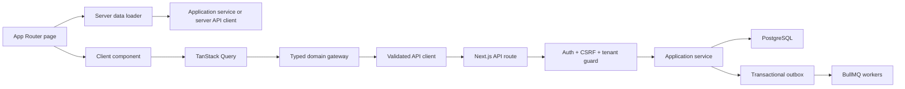
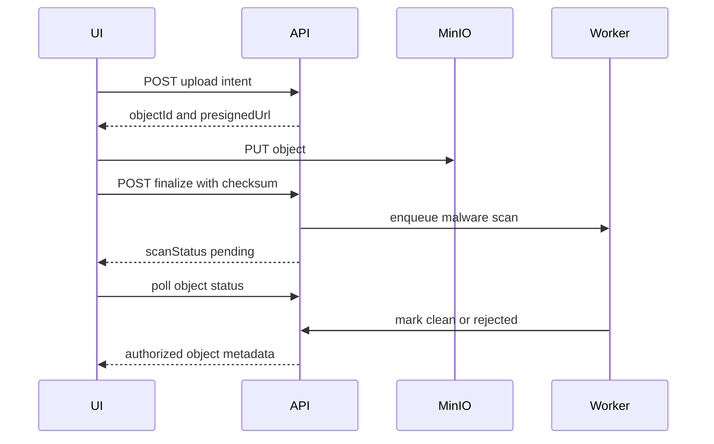

# Wheelio TN — Frontend/Backend API Fetching and Cutover Plan

**Status:** implementation plan  
**Scope:** all public, customer, agency, and admin frontend surfaces  
**Application:** `wheelio-frontend`  
**Backend:** Next.js App Router modular monolith, Better Auth, PostgreSQL/Drizzle, Redis/BullMQ, MinIO  
**Supported locales:** English (`en`) and French (`fr`) only  
**Money:** Tunisian dinar represented as integer millimes, serialized over HTTP as decimal strings  
**Primary source of truth after cutover:** PostgreSQL through `/api/v1/**` and Better Auth through `/api/auth/**`

---

## 1. Purpose

This document defines how every Wheelio TN frontend surface will read from and write to the backend APIs, how API state will replace demo/localStorage state, and how the migration will be verified safely.

It is deliberately separate from `WHEELIO_BACKEND_API_ARCHITECTURE_PLAN.md`. The backend architecture document describes the domain model and intended backend behavior; this document describes the frontend data-access architecture and the route-by-route cutover.

The finished integration must guarantee:

1. Every domain read comes from an authoritative backend contract.
2. Every command is authenticated, authorized, CSRF-safe, idempotent where required, and concurrency-safe.
3. Public, customer, agency, and admin views converge on the same canonical entities.
4. No page treats browser storage, demo workspaces, or same-browser synchronization as domain truth.
5. Loading, error, empty, conflict, stale, forbidden, and offline states are handled consistently.
6. Frontend contracts are runtime validated, not trusted through TypeScript casts.
7. EN/FR locale behavior and TND millime behavior are preserved end to end.
8. Deposits remain separate from GMV, commission, invoices, agency payouts, and analytics.
9. Rollout and rollback are controlled without dual-writing mutable domain data.

---

## 2. Current-state baseline

### 2.1 Repository state

The current repository contains:

- 213 frontend page routes.
- A large `/api/v1` backend surface plus the Better Auth catch-all.
- PostgreSQL/Drizzle schemas and migrations.
- Better Auth sessions, email/password login, magic links, verification, and TOTP.
- Handwritten API gateways under `wheelio-frontend/lib/gateways`.
- A small number of handwritten hooks under `wheelio-frontend/lib/hooks`.
- Feature-flagged coexistence between API-backed flows and demo/localStorage flows.
- Backend-focused tests for foundations, money rules, isolation scaffolds, and selected concurrency behavior.

The existing backend plan contains stale statements claiming production APIs and schema do not exist. Current code is the implementation baseline; discrepancies must be resolved explicitly rather than copying old endpoint names back into the code.

### 2.2 Existing frontend fetch paths

Frontend state currently comes from several competing paths:

1. `lib/api/client.ts` HTTP calls.
2. Domain gateways under `lib/gateways/**`.
3. Repetitive `useEffect`/`useState` hooks under `lib/hooks/**`.
4. Direct server-side application-service calls.
5. Static catalog/content modules.
6. Demo workspaces in `lib/admin.ts`, `lib/agency.ts`, `lib/bookings.ts`, and related files.
7. Browser storage through keys such as:
   - `wheelio-demo-session`
   - `wheelio-demo-user`
   - `wheelio-bookings`
   - `wheelio-agency-workspace`
   - `wheelio-agency-session`
   - `wheelio-agency-branch`
   - `wheelio-admin-workspace`
   - `wheelio-admin-session`
   - `wheelio-partner-application`
   - `wheelio-contract-artifacts`

This fragmentation allows the same booking, agency, customer, or financial record to differ between pages.

### 2.3 Existing API-client limitations

`wheelio-frontend/lib/api/client.ts` currently:

- Casts generic response data without runtime validation.
- Discards response metadata, pagination, ETags, status, and useful headers.
- Defaults every request to `Accept-Language: en`.
- Does not implement timeouts or compose abort signals.
- Assumes every non-204 response is valid JSON.
- Does not classify retryable failures.
- Does not expose `Retry-After`.
- Does not support stable idempotency keys as a first-class option.
- Does not support `If-Match` or expected-version conventions centrally.
- Duplicates singleton and collection request behavior.

This client must be replaced before broad page cutover.

### 2.4 Existing feature flags

Current flags:

- `NEXT_PUBLIC_API_SLICE_AUTH`
- `NEXT_PUBLIC_API_SLICE_CATALOG`
- `NEXT_PUBLIC_API_SLICE_CHECKOUT`
- `NEXT_PUBLIC_API_SLICE_AGENCY`
- `NEXT_PUBLIC_API_SLICE_ADMIN`

These are build-time public environment variables. They are useful as temporary migration switches, but they are not sufficient as production rollout controls because they cannot:

- target cohorts dynamically;
- be changed without rebuilding;
- provide percentage rollout;
- act as secure authorization boundaries;
- isolate reads and writes independently;
- provide per-domain kill switches.

### 2.5 Existing HTTP envelope

Successful singleton response:

```json
{
  "data": {},
  "meta": {
    "requestId": "req_...",
    "locale": "en"
  }
}
```

Successful collection response:

```json
{
  "data": [],
  "page": {
    "nextCursor": null,
    "hasMore": false
  },
  "meta": {
    "requestId": "req_...",
    "locale": "en"
  }
}
```

Error response:

```json
{
  "error": {
    "code": "VERSION_CONFLICT",
    "message": "Resource changed",
    "details": {},
    "requestId": "req_..."
  }
}
```

Response headers include `X-Request-Id` and `X-Correlation-Id`. ETag support exists in the response helper but is not consistently used.

---

## 3. Critical backend blockers before frontend authority cutover

Frontend migration must not make insecure or inconsistent endpoints authoritative. The following backend issues are preconditions, not optional cleanup.

### 3.1 Booking and guest-access authorization

Some booking services allow a null principal to read or mutate a booking when the caller knows its ID and version.

Required fix:

- Introduce a persisted `booking_access_grants` capability for guest bookings.
- Store only a hash of the grant token.
- Bind grants to booking, allowed scopes, expiry, and revocation state.
- Require either:
  - authenticated ownership;
  - valid guest booking grant;
  - correctly scoped agency membership;
  - correctly authorized admin membership.
- Apply this guard to booking detail, cancellation, modification, schedule, documents, voucher, messages, payment intents, and claims.
- Never expose booking PII solely on possession of an opaque booking ID.

### 3.2 Payment and upload authorization

Required fix:

- Payment intent creation must require booking ownership/grant or authorized staff scope.
- Payment confirmation must validate that the intent belongs to the caller’s accessible booking.
- Upload intents must record the principal, owner type, owner ID, purpose, expected MIME, and expected size.
- Upload finalization must always validate ownership, regardless of whether the principal is null.
- Finalization must verify object existence, actual size, checksum, and content type before moving from quarantine.
- Public/private download access must use signed URLs created only after authorization.

### 3.3 CSRF

Every cookie-authenticated write under `/api/v1/**` must call a common CSRF/origin guard.

Minimum policy:

- Reject cross-origin `Origin`.
- Validate `Sec-Fetch-Site` where present.
- Require same-origin requests for browser session writes.
- Exempt only signed provider webhooks.
- Add a synchronizer/double-submit token only if deployment topology makes strict origin validation insufficient.
- Test POST, PUT, PATCH, and DELETE routes.

Better Auth `trustedOrigins` does not automatically protect custom `/api/v1/**` routes.

### 3.4 Admin RBAC and MFA

Required fix:

- Define a route-command permission matrix for:
  - super admin;
  - operations;
  - finance;
  - support;
  - content;
  - read-only analyst.
- Reject writes from read-only roles.
- Enforce MFA/recent authentication for sensitive commands.
- Enforce dual control for payout release, force cancellation/refund, legal CMS publication, agency suspension, and privileged staff/security changes.
- Keep impersonation read-only at a common command boundary, not route-by-route convention.

### 3.5 Agency tenant selection

The principal currently tends to select the first membership.

Required fix:

- Add explicit active-agency selection.
- Validate membership on every request.
- Carry selected tenant in a signed, server-readable session field or validated request header.
- Enforce branch scope.
- Clear agency query caches when the tenant changes.
- Never infer the tenant by array ordering.

### 3.6 Status vocabularies

Canonicalize:

- agency publication/verification: choose one vocabulary (`draft`, `pending`, `verified`, `suspended`, `rejected`) and make public visibility rules explicit;
- reviews: choose one publication state (`published`) rather than mixing `visible` and `published`;
- booking state transitions;
- payment/refund/payout state transitions;
- CMS publication state.

Export these enums through shared Zod contracts.

### 3.7 Optimistic concurrency

Required fix:

- All versioned updates must atomically execute `UPDATE ... WHERE id = ? AND version = ?`.
- Zero updated rows must return `409 VERSION_CONFLICT`.
- Do not check version and then update only by ID.
- Use one frontend convention:
  - `If-Match: "<version>"` preferred; or
  - required `expectedVersion` in every versioned command.
- Emit ETags consistently on versioned reads if `If-Match` is adopted.

### 3.8 Idempotency

Use `Idempotency-Key` header consistently.

Required coverage:

- contact enquiry;
- quote/hold creation;
- booking creation;
- cancellation application;
- modification application;
- payment intent creation;
- privacy export/deletion;
- messages when client retries are possible;
- agency booking lifecycle commands;
- invitations;
- claims/cases;
- refunds;
- invoices;
- payouts;
- reconciliation runs;
- dual-control requests.

The idempotency service must:

- scope keys by principal and command;
- hash the canonical request payload;
- return completed responses on replay;
- reject same key/different payload;
- return an explicit in-flight response;
- clean up expired keys;
- be exercised by integration and race tests.

### 3.9 Pagination

Collection endpoints must stop returning placeholder cursors.

Required contract:

- `limit` bounded to 1–100;
- opaque cursor;
- deterministic order with ID tie-breaker;
- `nextCursor`;
- `hasMore`;
- filters represented in query keys;
- invalid cursor returns `422 VALIDATION_ERROR`;
- no offset pagination for high-write operational lists.

### 3.10 Outbox and workers

Before production:

- claim rows atomically with `FOR UPDATE SKIP LOCKED` or an explicit lease;
- prevent concurrent workers from publishing the same event;
- add retry schedule and dead-letter policy;
- implement real consumers for email, notifications, contract/PDF generation, analytics, and provider integration;
- make consumer side effects idempotent.

### 3.11 Read safety

GET endpoints must not create defaults. Replace read-time insertion in agency settings, branch hours, and SLA with:

- migrations/seeds;
- explicit initialization commands; or
- pure in-memory defaults returned without persistence.

---

## 4. Target frontend data architecture



### 4.1 Authority rules

1. PostgreSQL-backed services are authoritative for domain data.
2. Better Auth cookies are authoritative for identity/session state.
3. Redis is ephemeral coordination/cache infrastructure, never durable domain truth.
4. MinIO stores objects; PostgreSQL stores object metadata and authorization.
5. Browser storage may contain only device hints:
   - locale;
   - theme;
   - non-sensitive UI preferences.
6. Browser storage must not contain:
   - sessions or auth tokens;
   - users/customers;
   - bookings;
   - applications;
   - agencies;
   - admin workspaces;
   - contracts;
   - claims;
   - financial records.

### 4.2 Server Component rules

Server Components may:

- call application services directly for same-process reads when the service has an explicit read contract and receives a verified principal;
- use a server-only API client when preserving HTTP behavior is important;
- prefetch TanStack Query data and dehydrate it into a client boundary.

Server Components must not:

- import Drizzle table row types into UI props;
- call browser gateways;
- use localStorage;
- construct unauthenticated absolute requests that lose cookies;
- duplicate authorization logic.

Recommended rule:

- Public SEO reads: server application-service adapter.
- Authenticated interactive dashboards: server prefetch through a server-only typed gateway, then hydrate TanStack Query.
- Mutations: HTTP routes only, so CSRF, idempotency, auditing, and response semantics are exercised consistently.

### 4.3 Client Component rules

Client Components must:

- use query/mutation hooks;
- call only typed gateways;
- render standardized state components;
- propagate locale;
- clear sensitive caches on logout/tenant change;
- never import server modules, Drizzle, or database schemas.

### 4.4 Proposed file structure

```text
wheelio-frontend/
  lib/api/
    client.ts
    server-client.ts
    envelopes.ts
    errors.ts
    csrf.ts
    idempotency.ts
    locale.ts
    retry.ts
  lib/contracts/
    auth.ts
    public.ts
    account.ts
    bookings.ts
    agency.ts
    admin.ts
    finance.ts
    uploads.ts
  lib/query/
    provider.tsx
    keys.ts
    policies.ts
    hydration.tsx
  lib/gateways/
    public.ts
    account.ts
    bookings.ts
    agency.ts
    admin.ts
    uploads.ts
  lib/hooks/
    public/
    account/
    bookings/
    agency/
    admin/
  components/api-state/
    route-loading.tsx
    route-error.tsx
    empty-state.tsx
    forbidden-state.tsx
    conflict-dialog.tsx
    stale-data-banner.tsx
  app/
    providers.tsx
```

---

## 5. Typed API client specification

### 5.1 Runtime validation

Adopt Zod response validation for every endpoint.

```ts
type ApiMeta = {
  requestId: string
  locale?: "en" | "fr"
}

type ApiPage = {
  nextCursor: string | null
  hasMore: boolean
}

type ApiResult<T> = {
  data: T
  meta: ApiMeta
  status: number
  headers: Headers
  etag: string | null
}

type ApiCollectionResult<T> = ApiResult<T[]> & {
  page: ApiPage
}
```

The client must validate:

- envelope shape;
- DTO shape;
- money as `/^-?\d+$/`;
- locale as `en|fr`;
- timestamps as ISO-8601 strings;
- enum values;
- nullable fields;
- version as a positive integer;
- IDs as opaque non-empty strings.

Malformed successful responses must throw `INVALID_API_RESPONSE`, be reported to telemetry, and show a recoverable error UI.

### 5.2 Client options

```ts
type ApiRequestOptions<TBody> = {
  method?: "GET" | "POST" | "PUT" | "PATCH" | "DELETE"
  body?: TBody
  signal?: AbortSignal
  timeoutMs?: number
  locale?: "en" | "fr"
  idempotencyKey?: string
  expectedVersion?: number
  retryPolicy?: "none" | "safe-read" | "idempotent-command"
}
```

### 5.3 Required behavior

- Always send `credentials: "include"`.
- Send current locale, not hard-coded English.
- Send `Accept: application/json`.
- Send `Content-Type: application/json` only when a body exists.
- Add `Idempotency-Key` for protected commands.
- Add `If-Match` or normalized expected-version behavior.
- Compose caller abort signal with a timeout signal.
- Handle 204 without parsing JSON.
- Handle invalid or empty JSON safely.
- Preserve:
  - status;
  - headers;
  - request ID;
  - correlation ID;
  - ETag;
  - page metadata;
  - retry-after.
- Never retry:
  - validation errors;
  - authorization errors;
  - version conflicts;
  - non-idempotent commands without a stable key.
- Retry safe reads only for network failure, 408, 429, 502, 503, or 504 with bounded exponential backoff and jitter.

### 5.4 Error model

```ts
type ApiErrorCode =
  | "AUTH_REQUIRED"
  | "EMAIL_VERIFICATION_REQUIRED"
  | "MFA_REQUIRED"
  | "STEP_UP_REQUIRED"
  | "FORBIDDEN"
  | "TENANT_SCOPE_VIOLATION"
  | "IMPERSONATION_READ_ONLY"
  | "NOT_FOUND"
  | "GONE"
  | "VALIDATION_ERROR"
  | "UNSUPPORTED_LOCALE"
  | "VERSION_CONFLICT"
  | "ILLEGAL_STATE_TRANSITION"
  | "INVENTORY_CONFLICT"
  | "HOLD_EXPIRED"
  | "PAYMENT_REQUIRED"
  | "PAYMENT_PROVIDER_ERROR"
  | "REFUND_LIMIT_EXCEEDED"
  | "DUAL_CONTROL_REQUIRED"
  | "SELF_APPROVAL_FORBIDDEN"
  | "APPROVAL_EXPIRED"
  | "IDEMPOTENCY_KEY_REUSED"
  | "RATE_LIMITED"
  | "UPLOAD_REJECTED"
  | "TEMPORARY_UNAVAILABLE"
  | "INTERNAL_ERROR"
```

### 5.5 Error-to-UX policy

| Code/status | Frontend behavior |
|---|---|
| 401 / `AUTH_REQUIRED` | Clear sensitive query cache, preserve return URL, redirect to the correct login surface |
| `EMAIL_VERIFICATION_REQUIRED` | Route to verification with resend action |
| `MFA_REQUIRED` | Route to MFA challenge; resume command after success only if safe |
| `STEP_UP_REQUIRED` | Open reauthentication dialog |
| 403 / `FORBIDDEN` | Render forbidden state; do not retry |
| `TENANT_SCOPE_VIOLATION` | Clear active tenant, require tenant reselection, report security telemetry |
| `IMPERSONATION_READ_ONLY` | Keep view, disable command, explain read-only session |
| 404 / `NOT_FOUND` | Route-specific not-found state |
| 410 / `GONE` | Explain expired/removed resource and provide recovery path |
| 422 / `VALIDATION_ERROR` | Map `details.issues` to fields and form summary |
| `VERSION_CONFLICT` | Show conflict dialog: reload latest, review changes, reapply |
| `ILLEGAL_STATE_TRANSITION` | Refetch entity/timeline and explain current state |
| `INVENTORY_CONFLICT` | Return to offer alternatives |
| `HOLD_EXPIRED` | Invalidate quote/hold, request a new quote |
| `PAYMENT_REQUIRED` | Route to payment step |
| `PAYMENT_PROVIDER_ERROR` | Keep command state, allow safe retry with same key |
| `DUAL_CONTROL_REQUIRED` | Show pending-approval state |
| `SELF_APPROVAL_FORBIDDEN` | Disable approval, explain separation of duties |
| `IDEMPOTENCY_KEY_REUSED` | Do not retry; generate a new logical command only after user changes intent |
| 429 / `RATE_LIMITED` | Respect `Retry-After`, show countdown |
| `UPLOAD_REJECTED` | Explain MIME/size/scan reason; revoke preview |
| 503 / `TEMPORARY_UNAVAILABLE` | Retry safe reads; show dependency outage |
| 500 / `INTERNAL_ERROR` | Generic message plus request ID; no sensitive details |

---

## 6. Authentication, session, locale, and tenant context

### 6.1 Better Auth

Use the installed Better Auth client for:

- sign up;
- sign in;
- sign out;
- verification;
- magic links;
- password reset;
- TOTP setup/challenge;
- session list/revocation.

Do not wrap Better Auth endpoints in duplicate `/api/v1` identity endpoints.

### 6.2 Auth boundaries

Create server-side guards:

- `requireCustomerPage()`
- `requireAgencyPage(permission?)`
- `requireAdminPage(permission?)`

These guards must:

- read the Better Auth session;
- resolve the effective principal;
- enforce verification/MFA where required;
- resolve the active tenant;
- redirect before rendering protected data;
- never trust client-side role checks.

### 6.3 Locale

- Locale source order:
  1. authenticated profile preference;
  2. route or cookie device hint;
  3. `Accept-Language`;
  4. English fallback.
- Send locale on every API call.
- Include locale in query keys for localized resources.
- Reject Arabic and unsupported locales.
- Locale changes invalidate localized CMS/catalog queries.

### 6.4 Logout and tenant change

On logout:

- cancel active queries;
- clear the entire sensitive query cache;
- remove only permitted temporary UI state;
- terminate live subscriptions/polling;
- redirect to the correct portal login.

On agency tenant change:

- cancel agency queries;
- clear all agency-scoped keys;
- update signed tenant context;
- refetch `/me`;
- navigate to the selected agency dashboard.

---

## 7. Query/cache architecture

Adopt TanStack Query for authenticated and interactive client state.

### 7.1 Query-key factory

```ts
const qk = {
  me: ["me"] as const,
  sessions: ["me", "sessions"] as const,
  account: {
    profile: ["account", "profile"] as const,
    drivers: ["account", "drivers"] as const,
    driver: (id: string) => ["account", "drivers", id] as const,
    preferences: ["account", "preferences"] as const,
    notifications: ["account", "notification-preferences"] as const,
    savedSearches: ["account", "saved-searches"] as const,
    savedOffers: ["account", "saved-offers"] as const,
  },
  public: {
    bootstrap: (locale: string) => ["public", "bootstrap", locale] as const,
    locations: (locale: string, filters: object) =>
      ["public", "locations", locale, filters] as const,
    location: (slug: string, locale: string) =>
      ["public", "location", slug, locale] as const,
    categories: (locale: string) => ["public", "categories", locale] as const,
    agencies: (locale: string, filters: object) =>
      ["public", "agencies", locale, filters] as const,
    agency: (slug: string, locale: string) =>
      ["public", "agency", slug, locale] as const,
    cms: (kind: string, slug: string | null, locale: string) =>
      ["public", "cms", kind, slug, locale] as const,
  },
  quote: (id: string) => ["quote", id] as const,
  bookings: {
    list: (filters: object) => ["bookings", "list", filters] as const,
    detail: (id: string) => ["bookings", "detail", id] as const,
    messages: (id: string) => ["bookings", id, "messages"] as const,
    documents: (id: string) => ["bookings", id, "documents"] as const,
  },
  agency: {
    dashboard: (tenant: string) => ["agency", tenant, "dashboard"] as const,
    bookings: (tenant: string, filters: object) =>
      ["agency", tenant, "bookings", filters] as const,
    booking: (tenant: string, id: string) =>
      ["agency", tenant, "booking", id] as const,
    fleet: (tenant: string, filters: object) =>
      ["agency", tenant, "fleet", filters] as const,
    branches: (tenant: string) => ["agency", tenant, "branches"] as const,
    rates: (tenant: string) => ["agency", tenant, "rates"] as const,
    team: (tenant: string) => ["agency", tenant, "team"] as const,
    finance: (tenant: string) => ["agency", tenant, "finance"] as const,
  },
  admin: {
    bookings: (filters: object) => ["admin", "bookings", filters] as const,
    booking: (id: string) => ["admin", "booking", id] as const,
    agencies: (filters: object) => ["admin", "agencies", filters] as const,
    agency: (id: string) => ["admin", "agency", id] as const,
    customers: (filters: object) => ["admin", "customers", filters] as const,
    customer: (id: string) => ["admin", "customer", id] as const,
    cases: (filters: object) => ["admin", "cases", filters] as const,
    claims: (filters: object) => ["admin", "claims", filters] as const,
    ledger: (filters: object) => ["admin", "finance", "ledger", filters] as const,
  },
}
```

### 7.2 Cache policies

| Domain | Stale time | Refetch behavior |
|---|---:|---|
| Public bootstrap | 5 minutes | focus refetch off |
| Locations/categories | 10 minutes | locale change invalidates |
| Public agencies/reviews | 2 minutes | focus refetch on |
| CMS published content | 5 minutes | invalidate after admin publication |
| `/me` | 30 seconds | focus refetch on |
| Account profile/preferences | 1 minute | mutation invalidates |
| Search results | 30 seconds | key includes complete criteria |
| Quote/hold | until server expiry | poll only near expiry |
| Booking detail | 15 seconds | focus refetch on |
| Booking messages | 5 seconds or subscription | stop when page hidden if polling |
| Agency dashboard/queues | 15 seconds | focus refetch on |
| Agency fleet/rates/policies | 1 minute | mutation invalidates |
| Admin operational queues | 10 seconds | focus refetch on |
| Admin audit/ledger | 30 seconds | never optimistic |
| Analytics rollups | 2 minutes | rebuild command invalidates |

### 7.3 Cross-surface invalidation

Booking mutation must invalidate:

- customer booking detail/list/calendar;
- agency booking detail/list/dashboard/calendar;
- admin booking detail/list/timeline;
- related finance queries when money changes.

Agency verification mutation must invalidate:

- admin agency detail/list;
- agency dashboard/settings;
- public agency profile/list.

CMS publication must invalidate:

- admin CMS queries;
- public CMS key for affected kind/slug/locale.

Payout/refund mutation must invalidate:

- admin ledger/payout/refund/reconciliation;
- agency payouts/ledger/invoices;
- affected booking money view.

---

## 8. Mutation standard

### 8.1 Stable idempotency keys

Generate one key per logical user command, not per network attempt.

Lifecycle:

1. Generate key when the user begins a command.
2. Keep it in mutation state until success, terminal rejection, or intentional reset.
3. Reuse the key for network retries.
4. Do not persist keys long-term in localStorage.
5. If the user changes command payload, generate a new key.

### 8.2 Optimistic updates

Allowed:

- notification read state;
- saved search/offer deletion with rollback;
- non-financial UI preferences;
- low-risk labels/notes when rollback is deterministic.

Avoid optimistic updates:

- booking lifecycle;
- inventory holds;
- payments/refunds;
- payouts;
- claims;
- agency verification/suspension;
- dual-control;
- CMS publication;
- staff/role/security changes.

These commands should show pending state, await canonical response, then invalidate/refetch.

### 8.3 Conflict UX

For `VERSION_CONFLICT`:

1. Preserve user draft.
2. Fetch latest entity.
3. Show changed fields.
4. Offer:
   - discard local draft;
   - reapply compatible draft;
   - copy draft text.
5. Never silently overwrite.

### 8.4 Mutation pending behavior

- Disable duplicate submit.
- Preserve navigation warning for long forms.
- Use accessible `aria-live` status.
- Do not show success until backend transaction commits.
- For `202 Accepted`, show job state and poll a status endpoint using bounded intervals.

---

## 9. Upload flow



Requirements:

- Client validates size/type before requesting intent.
- Server independently validates declared and actual properties.
- Upload progress uses XHR or a suitable streaming client.
- Abort cancels the browser upload.
- Signed URLs never enter telemetry.
- UI does not publish or attach media until scan status is clean.
- Rejected media is removed from previews.

---

## 10. Standard route states

Every data-backed page must implement:

1. Initial loading skeleton.
2. Background refresh indicator without replacing useful data.
3. Empty state.
4. Filtered-empty state.
5. Not-found state.
6. Forbidden state.
7. Unauthenticated redirect.
8. Offline/network state.
9. Temporary backend outage state.
10. Field validation state.
11. Version-conflict state.
12. Partial/stale-data banner.
13. Mutation pending/success/failure state.

Add route-level `loading.tsx` and `error.tsx` boundaries for major route groups:

- account;
- bookings/trips;
- agency;
- admin;
- checkout.

Error boundaries must expose retry and a safe request ID, never stack traces or sensitive payloads.

---

## 11. Page-to-API migration manifest

The tables below define the target fetches. “Static” means no domain fetch is required; localized CMS pages should still use CMS APIs when content is managed.

### 11.1 Public, marketing, catalog, and partner pages

| Frontend route(s) | Target API | Query/mutation | Notes |
|---|---|---|---|
| `/` | `GET /public/bootstrap`, `/public/locations`, `/public/categories`, `/public/agencies`, `/public/reviews` | public query keys by locale | Server prefetch; remove static catalog duplication |
| `/about` | `GET /public/cms/page/about` | CMS query | EN/FR |
| `/faq` | `GET /public/cms/faq` | CMS collection | Published content only |
| `/guides` | `GET /public/cms/guide` | CMS collection | Cursor pagination |
| `/guides/[slug]` | `GET /public/cms/guide/{slug}` | CMS detail | Locale fallback |
| `/help` | `GET /public/cms/help` | CMS collection | Server rendered |
| `/help/[article]` | `GET /public/cms/help/{article}` | CMS detail | Server rendered |
| `/terms`, `/privacy`, `/cookies`, `/cancellation-policy` | `GET /public/cms/legal/{slug}` | CMS detail | Legal publication must be approved |
| `/how-it-works` | `GET /public/cms/page/how-it-works` | CMS detail | Remove hard-coded content |
| `/locations` | `GET /public/locations` | locations key | Server prefetch |
| `/locations/[slug]` | `GET /public/locations/{slug}`, `/public/agencies?location=` | location/agencies keys | Remove static location module |
| `/cars/types` | `GET /public/categories` | categories key | Rename UI “types” without changing API |
| `/cars/types/[type]` | `GET /public/categories/{code}`, `POST /search` | category detail/search | Search only after criteria submitted |
| `/cars/[id]` | quote/offer detail contract | offer detail | Add canonical public offer endpoint if ID is durable |
| `/agencies` | `GET /public/agencies` | agencies filters | Locale/city/rating in key |
| `/agencies/[slug]` | `GET /public/agencies/{slug}`, `/public/reviews?agencyId=` | agency/reviews keys | Server prefetch |
| `/reviews` | `GET /public/reviews` | paged reviews key | Filter by location/agency/rating |
| `/contact` | `POST /public/contact-enquiries` | idempotent mutation | Stable key, consent required |
| `/partners` | `GET /public/partner-content` | partner content key | CMS-backed |
| `/partners/faq` | `GET /public/partner-content` or CMS FAQ | partner content key | EN/FR |
| `/partners/join` | **Add** `POST /public/partner-applications` | idempotent form mutation | Current admin application API is not a public submission API |
| `/partners/join/success` | application receipt/status grant | status query | Must not read local application |
| `/dev/emails` | development-only server route | no production query | Disable outside development |

### 11.2 Authentication and account

| Frontend route(s) | Target API | Query/mutation | Notes |
|---|---|---|---|
| `/signup` | Better Auth sign-up | auth mutation | No auth data in localStorage |
| `/login` | Better Auth sign-in | auth mutation | Preserve return URL |
| `/logout` | Better Auth sign-out | auth mutation | Clear query cache |
| `/forgot-password`, `/reset-password` | Better Auth recovery | auth mutation | Generic anti-enumeration messages |
| `/auth/verify` | Better Auth verification | auth mutation | Resume intended route |
| `/auth/magic` | Better Auth magic link | auth mutation | One-time token |
| `/account` | `GET /me`, profile/preferences summaries | hydrated account queries | No demo user |
| `/account/welcome` | `GET/PATCH /account/profile` | profile mutation | Required version |
| `/account/profile` | `GET/PATCH /account/profile` | profile query/mutation | Conflict UX |
| `/account/preferences` | `GET/PATCH /account/preferences` | preferences query/mutation | Locale change invalidates localized keys |
| `/account/security` | Better Auth + `GET /me/sessions` | sessions/auth mutation | Revoke sessions |
| `/account/drivers` | `GET /account/drivers` | drivers key | Paged if list grows |
| `/account/drivers/new` | `POST /account/drivers` | idempotent mutation | Licence masking |
| `/account/drivers/[id]` | `GET/PATCH/DELETE /account/drivers/{id}` | driver key/mutations | Required version |
| `/account/notifications` | notification feed endpoint | query | Add customer notification inbox if absent |
| `/account/notifications/settings` | `GET/PUT /account/notification-preferences` | mutation | Email/SMS matrix |
| `/account/saved` | saved searches and offers APIs | two queries | Invalidate on delete |
| `/account/payments` | customer payment methods/history endpoint | query | Add provider-backed endpoint; do not fake cards |
| `/account/privacy` | privacy export/deletion APIs | async commands | Show request status |
| `/account/claim` | customer claim creation/status | claim mutation/query | Add customer-scoped claim API |

### 11.3 Search, quotes, checkout

| Frontend route | Target API | Query/mutation | Notes |
|---|---|---|---|
| `/search` | `POST /search` | query-like mutation keyed by criteria | Debounce only UI filters; server creates search session |
| offer selection | `POST /quotes`, `GET /quotes/{quoteId}` | quote mutation/query | Stable snapshot |
| hold acquisition | `POST /quotes/{quoteId}/holds` | idempotent mutation | Stable key; show expiry |
| hold release | `DELETE /quotes/{quoteId}/hold` | mutation | Best effort on abandon |
| `/checkout` | quote, hold, profile/drivers | composed queries | Do not trust client price |
| booking submit | `POST /bookings` | idempotent mutation | One booking per logical checkout |
| payment step | `POST /bookings/{id}/payment-intents` | idempotent mutation | Rental/deposit purposes separate |
| payment confirmation | `POST /payments/intents/{id}/confirm` | provider command | Real provider replaces stub |

### 11.4 Customer trips and booking pages

| Frontend route(s) | Target API | Notes |
|---|---|---|
| `/trips` | `GET /bookings` | Authenticated list; real cursor |
| `/trips/[id]` | `GET /bookings/{id}` | Ownership/grant required |
| `/trips/calendar` | `GET /bookings` with date range | Calendar key includes range |
| `/bookings/find` | booking grant exchange endpoint | Do not expose by ID/email alone |
| `/bookings/[id]` | `GET /bookings/{id}` | Canonical detail |
| `/bookings/[id]/confirmation` | booking detail/documents | Server-confirmed state |
| `/bookings/[id]/documents` | `GET /bookings/{id}/documents` | Signed downloads |
| `/bookings/[id]/voucher` | `GET /bookings/{id}/voucher` | Signed/authorized |
| `/bookings/[id]/messages` | `GET/POST /bookings/{id}/messages` | Poll/subscription; idempotent send |
| `/bookings/[id]/modify` | modification quote + apply | Required version |
| `/bookings/[id]/schedule` | `POST /bookings/{id}/schedule` | Required version |
| `/bookings/[id]/payments` | booking money/payment timeline | Add customer payment timeline endpoint |
| `/bookings/[id]/pickup` | booking detail/checklist | Add customer checklist read/acknowledge endpoint |
| `/bookings/[id]/return` | booking detail/return record | Read canonical return record |
| `/bookings/[id]/review` | `POST /bookings/{id}/review` | Add authenticated review command |
| `/bookings/[id]/claim` | customer claim endpoint | Ownership required |

### 11.5 Agency authentication, shell, onboarding

| Frontend route(s) | Target API | Notes |
|---|---|---|
| `/agency/login`, recovery routes | Better Auth | Agency membership resolved after auth |
| `/agency/logout` | Better Auth sign-out | Clear agency cache |
| `/agency/invite/[token]` | `POST /agency/invite/{token}` | Email must match session |
| `/agency` | `GET /agency/dashboard` | Tenant-scoped |
| `/agency/inbox` | agency booking/messages/notification queues | Prefer dedicated inbox aggregation |
| `/agency/notifications` | `GET /agency/notifications` | Cursor pagination |
| `/agency/notifications/settings` | notification preferences API | Mutation invalidates |
| `/agency/help/**` | public CMS help | Static/public read |
| `/agency/onboarding` and all onboarding steps | `GET/PUT /agency/onboarding?step=` | Canonicalize to path-based step later |
| `/agency/onboarding/documents` | `GET/POST /agency/documents`, upload APIs | Scan before approval |
| `/agency/onboarding/review` | onboarding summary | Submit application command if required |

### 11.6 Agency booking operations

| Frontend route(s) | Target API | Notes |
|---|---|---|
| `/agency/bookings` | `GET /agency/bookings` | Real cursor/filter/status |
| `/agency/bookings/calendar` | `GET /agency/calendar` | Date-range key |
| `/agency/bookings/[id]` | customer booking detail with agency scope | Canonical booking ID |
| `/accept` | acceptance or decline commands | Required version; SLA refetch |
| `/prepare` | prepare command | Persist checklist |
| `/handover` | handover command | No optimistic state |
| `/return` | return command | Money/deposit separate |
| `/issue` | issues command | Audit/outbox |
| `/documents` | agency booking documents | Signed URLs |
| `/finance` | agency booking finance | Deposit shown separately |
| `/messages` | agency booking messages | Invalidate customer/admin message keys |

### 11.7 Agency branches, fleet, rates, policies

| Frontend route(s) | Target API | Notes |
|---|---|---|
| `/agency/branches` and `/new` | `GET/POST /agency/branches` | Branch permission |
| `/agency/branches/[id]` | `GET/PATCH /agency/branches/{id}` | Atomic version |
| `/hours` | `GET/PUT /agency/branches/{id}/hours` | GET must not insert defaults |
| `/delivery` | `GET/POST /agency/branches/{id}/delivery` | Millimes |
| `/agency/fleet` and `/new` | `GET/POST /agency/fleet` | Tenant scoped |
| `/agency/fleet/[id]` | `GET/PATCH /agency/fleet/{id}` | Version conflict UX |
| `/photos` | media + upload APIs | Scan workflow |
| `/availability` | availability-block APIs | Date range/conflict |
| `/fleet/categories` | `GET /agency/fleet/categories` | Public catalog-derived |
| `/agency/calendar/**` | calendar + availability APIs | Shared keys |
| `/agency/rates` and `/new` | rates collection | Versioned |
| `/agency/rates/[id]` | rate detail/update | Add update route if GET-only |
| `/agency/rates/fees` | fees API | Deposit not fee |
| `/agency/rates/preview` | `POST /agency/rates/preview` | Preview excludes deposit |
| `/agency/policies/**` | policies collection/kind APIs | EN/FR keys |

### 11.8 Agency organization and finance

| Frontend route(s) | Target API | Notes |
|---|---|---|
| `/agency/team` | `GET /agency/team` | Members + pending invites |
| `/agency/team/invite` | `POST /agency/team/invite` | Token sent by email, not response |
| `/agency/team/[id]` | `PATCH /agency/team/{id}` | Role matrix + version |
| `/agency/settings/**` | `GET/PATCH /agency/settings` | Split DTO by section if needed |
| `/agency/reviews` | reviews + reply APIs | Reply once/version |
| `/agency/reports` | reports API | Explicit date range |
| `/agency/reports/quality` | quality API | Deposit excluded |
| `/agency/ledger` | ledger API | Cursor/date filters |
| `/agency/invoices` | invoices API | Signed PDF when generated |
| `/agency/payouts` | payouts API | Canonical item-derived total |
| `/agency/payouts/[id]` | payout detail | Every item `includesDeposit=false` |

### 11.9 Admin shell and operational control

| Frontend route(s) | Target API | Notes |
|---|---|---|
| `/admin/login`, recovery, MFA | Better Auth | Admin membership + MFA |
| `/admin` | analytics/queue aggregations | Permission-aware |
| `/admin/search` | add global search endpoint | Redacted by role |
| `/admin/notifications` | admin notifications API | Cursor |
| `/admin/audit` | audit API | Filters/cursor; sensitive |
| `/admin/sla` | SLA API | Sensitive update permission |
| `/admin/applications/**` | partner application APIs | Approval/rejection audit |
| `/admin/agencies` | admin agencies API | Filters/cursor |
| `/admin/agencies/[id]/**` | agency subresource APIs | Notes/docs/fleet/staff/rates/payouts/quality/contract |
| `/admin/bookings` | admin bookings API | Filters/cursor |
| `/admin/bookings/[id]/**` | detail/timeline/money/messages/override | Override requires MFA/dual control where sensitive |
| `/admin/customers` | customers API | PII redaction |
| `/admin/customers/[id]/**` | detail/bookings/risk APIs | Read audit for sensitive views |
| `/admin/cases/**` | cases APIs | Owner/status/version |
| `/admin/claims/**` | claims APIs | Deposit claim remains outside GMV |

### 11.10 Admin finance, catalog, content, staff, analytics

| Frontend route(s) | Target API | Notes |
|---|---|---|
| `/admin/finance` | finance summary endpoint | Add if absent |
| `/admin/finance/ledger` | ledger API | Double-entry |
| `/commissions` | commissions API | Deposit excluded |
| `/invoices` | invoice APIs | PDF worker |
| `/payouts/**` | payout APIs | Dual control for release |
| `/refunds/**` | refund APIs | Deposit releases are not refunds |
| `/reconciliation` | reconciliation APIs | Provider sync replaces manual stub |
| `/admin/vehicles/**` | vehicles APIs | Agency scope shown |
| `/admin/categories` | categories APIs | EN/FR |
| `/admin/fees-catalog` | fee catalog API | `isDeposit=false` |
| `/admin/locations/**` | location APIs | EN/FR translations |
| `/admin/promotions/**` | promotion APIs | Never applies to deposit |
| `/admin/content/**` | CMS revision/publication APIs | Add full entry/revision/publication endpoints |
| `/admin/content/reviews/**` | moderation APIs | Canonical `published` state |
| `/admin/staff/**` | staff APIs | Invite token delivered out-of-band |
| `/admin/settings/**` | settings API | Security updates require MFA/dual control |
| `/admin/feature-flags` | feature flag APIs | Server-delivered rollout |
| `/admin/analytics/**` | analytics APIs | Deposit excluded |
| `/admin/dev/emails` | development-only | Disable in production |

---

## 12. Canonical backend endpoint catalog

The frontend contract registry must cover these endpoint families.

### 12.1 Better Auth

- `GET|POST /api/auth/[...all]`

### 12.2 Public and discovery

- `GET /api/v1/public/bootstrap`
- `GET /api/v1/public/locations`
- `GET /api/v1/public/locations/{slug}`
- `GET /api/v1/public/categories`
- `GET /api/v1/public/categories/{code}`
- `GET /api/v1/public/agencies`
- `GET /api/v1/public/agencies/{slug}`
- `GET /api/v1/public/reviews`
- `GET /api/v1/public/cms/{kind}`
- `GET /api/v1/public/cms/{kind}/{slug}`
- `GET /api/v1/public/partner-content`
- `POST /api/v1/public/contact-enquiries`
- `POST /api/v1/search`
- `POST /api/v1/quotes`
- `GET /api/v1/quotes/{quoteId}`
- `POST /api/v1/quotes/{quoteId}/holds`
- `DELETE /api/v1/quotes/{quoteId}/hold`

### 12.3 Account

- `GET /api/v1/me`
- session list/revoke routes
- profile and preferences reads/updates
- driver CRUD
- notification preferences
- saved searches/offers
- privacy export/deletion/status

### 12.4 Customer booking

- booking list/create/detail
- cancellation quote/apply
- modification quote/apply
- schedule
- payment intents/confirmation
- documents/voucher
- messages
- upload intent/finalize

### 12.5 Agency

- dashboard/bookings/lifecycle/messages/documents/finance
- onboarding/documents/invite acceptance
- branches/hours/delivery
- fleet/categories/media
- rates/preview/fees
- policies
- availability/calendar
- team/invites
- notifications/preferences
- reviews/replies
- reports/quality
- ledger/invoices/payouts
- settings

### 12.6 Admin

- bookings/timeline/money/messages/override
- customers/bookings/risk
- agencies and all subresources
- cases/claims
- vehicles/categories/locations/promotions/fees
- feature flags/SLA/settings/security
- staff/invites/notifications/audit
- CMS/reviews
- analytics
- impersonation/dual control
- partner applications
- finance ledger/commissions/invoices/payouts/refunds/reconciliation

### 12.7 Infrastructure

- payment webhook
- liveness/readiness

Every catalog entry in code must declare:

- method;
- path;
- request schema;
- response schema;
- error codes;
- auth class;
- permission;
- tenant scope;
- idempotency requirement;
- concurrency requirement;
- cache policy;
- owning query keys;
- mutation invalidations.

---

## 13. Feature flags and rollout

### 13.1 Replace broad build-time authority flags

Add server-delivered flags:

- `public.catalog.read`
- `account.read`
- `account.write`
- `checkout.quote`
- `checkout.booking`
- `checkout.payment`
- `customer.booking.read`
- `customer.booking.write`
- `agency.booking.read`
- `agency.booking.write`
- `agency.fleet`
- `agency.rates`
- `agency.finance`
- `admin.operations`
- `admin.finance`
- `admin.content`
- `admin.security`

Flag response must be signed/derived server-side and tied to environment, user, tenant, and cohort.

### 13.2 Cutover rules

1. Cut over reads first.
2. Compare API reads to demo/static data only in non-production shadow telemetry.
3. Cut over writes only after reads and state UX are stable.
4. Never dual-write credentials, PII, bookings, or money.
5. If rollback disables new writes, records already created in the API remain API-authoritative.
6. Remove each demo fallback after its rollback window closes.
7. Flags are operational controls, not authorization.

---

## 14. Migration waves

### Wave 0 — Security and contract stabilization

- Fix guest booking/payment/upload access.
- Add CSRF guard.
- Complete admin RBAC/MFA.
- Add explicit tenant selection.
- Canonicalize status enums.
- Make version updates atomic.
- Expand idempotency.
- Implement real pagination.
- Remove write-on-GET behavior.

**Gate:** authorization matrix, CSRF, idempotency races, and version conflicts pass.

### Wave 1 — Fetching foundation

- Install/configure TanStack Query.
- Replace API client.
- Add shared Zod contracts.
- Add query keys and policies.
- Add auth/error boundaries and API state components.
- Add MSW fixtures.

**Gate:** client unit tests and provider integration tests pass.

### Wave 2 — Public reads

- Home, CMS/legal/help/guides, locations, categories, agencies, reviews.
- Remove static domain catalogs where API-authoritative.

**Gate:** EN/FR SSR and cache tests pass.

### Wave 3 — Account/auth

- All auth and account routes.
- Session revocation, drivers, preferences, privacy.

**Gate:** no user/session/PII domain state in localStorage.

### Wave 4 — Search/checkout

- Search, quotes, holds, checkout, booking creation, payment.

**Gate:** retry produces one booking; hold expiry recovery works.

### Wave 5 — Customer booking lifecycle

- Trips and every customer booking subpage.

**Gate:** access grant/ownership enforced; cross-surface booking version converges.

### Wave 6 — Agency onboarding and shell

- Agency auth, tenant selection, onboarding, dashboard, notifications.

**Gate:** role/tenant/branch tests pass.

### Wave 7 — Agency operations

- Bookings, fleet, branches, calendar, rates, policies, messages.

**Gate:** lifecycle and inventory concurrency tests pass.

### Wave 8 — Agency organization/finance

- Team, settings, reviews, reports, ledger, invoices, payouts.

**Gate:** deposit absent from commercial finance views.

### Wave 9 — Admin operations

- Core shell, applications, agencies, bookings, customers, cases, claims.

**Gate:** RBAC, PII redaction, MFA, dual control, impersonation tests pass.

### Wave 10 — Admin finance

- Ledger, commissions, invoices, payouts, refunds, reconciliation.

**Gate:** double-entry, replay, payout allocation, deposit-exclusion tests pass.

### Wave 11 — Admin content/configuration

- Catalog, content, moderation, staff, settings, flags, analytics.

**Gate:** publication, feature rollout, and analytics reconciliation pass.

### Wave 12 — Final cutover

- Remove demo workspaces and synchronization.
- Delete obsolete feature flags.
- Add static checks against forbidden storage/imports.
- Run full EN/FR E2E, load, abuse, accessibility, and rollback tests.

---

## 15. Testing strategy

### 15.1 API client unit tests

- singleton/collection/204 parsing;
- malformed JSON;
- runtime schema rejection;
- locale propagation;
- request/correlation ID extraction;
- timeout and cancellation;
- retry-after handling;
- safe retry classification;
- idempotency and expected-version headers;
- error code mapping.

### 15.2 Gateway contract tests

- Every gateway endpoint path/method.
- Request serialization.
- Response adapter.
- Money remains string millimes.
- Locale remains EN/FR.
- Deposit fields stay separate.

### 15.3 Query/mutation tests

- query-key stability;
- locale and tenant key isolation;
- cross-surface invalidation;
- logout cache clearing;
- optimistic rollback;
- conflict UX;
- stable idempotency key reuse;
- no retry of unsafe unprotected writes.

### 15.4 Component integration tests

Use MSW for:

- loading;
- empty;
- filtered empty;
- unauthorized;
- forbidden;
- validation;
- conflict;
- rate limit;
- temporary outage;
- stale/background refresh;
- mutation success/failure.

### 15.5 Backend integration/security tests

- CSRF matrix.
- Customer/agency/admin ownership.
- Guest grant scope and expiry.
- Multi-agency selection.
- Branch scope.
- Admin RBAC.
- MFA/step-up.
- Read-only impersonation.
- Idempotency replay and race.
- Atomic version conflict.
- Webhook replay.
- Upload ownership/actual object validation.
- Outbox concurrent workers.

### 15.6 Playwright flows

Run in EN and FR:

1. Sign up, verify, sign in, update profile, add driver, revoke session.
2. Search, quote, hold, booking, payment, confirmation.
3. Cancel and modify a booking.
4. Customer/agency/admin see the same booking/version.
5. Agency accepts, prepares, hands over, returns.
6. Agency manages fleet/rates/policies/team.
7. Admin verifies agency, handles case/claim, issues refund/payout.
8. CMS publish appears publicly.
9. Read-only impersonation cannot mutate.
10. Feature rollback does not copy API data back to localStorage.

---

## 16. Observability

Frontend telemetry may include:

- route template;
- endpoint name, not raw URL with IDs;
- duration;
- status;
- API error code;
- request ID;
- cache hit/miss/stale;
- retry count;
- feature cohort;
- release/version;
- locale;
- tenant type, not tenant PII.

Never include:

- passwords/tokens/cookies;
- request/response bodies;
- email, phone, licence, IBAN;
- signed object URLs;
- message contents;
- claim/case contents.

Dashboards:

- API error rate by endpoint/error code.
- Frontend route failure rate.
- 401/403/409/429 trends.
- checkout conversion and hold expiry.
- stale/conflict rates.
- provider failures.
- cache hit rate.
- cutover cohort comparison.

---

## 17. Definition of done per page

A page is API-complete only when:

- [ ] all domain reads use typed authoritative contracts;
- [ ] all writes use protected API commands;
- [ ] response data is runtime validated;
- [ ] auth, permission, tenant, and CSRF behavior are tested;
- [ ] locale and money contracts are correct;
- [ ] query key and cache policy are declared;
- [ ] mutation idempotency and version behavior are declared;
- [ ] cross-surface invalidations are implemented;
- [ ] loading/error/empty/conflict/offline states are accessible;
- [ ] request ID is available for support;
- [ ] telemetry contains no PII;
- [ ] feature rollout and rollback are tested;
- [ ] no demo/localStorage domain truth remains;
- [ ] component and E2E tests pass.

---

## 18. Static enforcement

Add CI checks that fail when API-authoritative routes import:

- `lib/admin.ts`
- `lib/agency.ts`
- `lib/bookings.ts`
- `lib/admin-agency-sync.ts`
- demo session/workspace helpers

Add a forbidden-key check for domain localStorage keys. Allow only locale/theme device hints.

Add dependency boundaries:

- `app/**` client files may import gateways/hooks/contracts.
- client code may not import `server/**` or `db/**`.
- gateways may import API client and contracts.
- shared contracts may not import database schemas.

---

## 19. Exact first implementation slice

Create or replace:

1. `lib/api/envelopes.ts`
2. `lib/api/errors.ts`
3. `lib/api/client.ts`
4. `lib/api/server-client.ts`
5. `lib/api/csrf.ts`
6. `lib/api/idempotency.ts`
7. `lib/contracts/common.ts`
8. domain contract files
9. `lib/query/provider.tsx`
10. `lib/query/keys.ts`
11. `lib/query/policies.ts`
12. API state components
13. CSRF backend middleware/helper
14. common authorization helpers

Then migrate one vertical proof:

- `/account/profile`;
- `/agency/bookings/[id]`;
- `/admin/bookings/[id]`.

All three must read the same canonical booking/customer data where applicable, exercise runtime validation, errors, versions, invalidation, and role boundaries.

Only after this proof passes should the migration proceed through Waves 2–12.

---

## 20. Final acceptance gate

The frontend/backend integration is complete when:

1. All 213 pages are classified as static or API-backed.
2. Every API-backed page has an entry in the route manifest.
3. Every backend endpoint has a typed frontend contract or is explicitly server/webhook-only.
4. No custom API mutation lacks CSRF policy.
5. No high-risk mutation lacks idempotency.
6. No versioned update can silently overwrite concurrent data.
7. No anonymous caller can access booking/payment/upload data without a scoped grant.
8. Admin RBAC/MFA/dual-control rules are enforced server-side.
9. All collection endpoints have real pagination.
10. Customer, agency, and admin views converge on canonical IDs and versions.
11. Deposits are absent from GMV, commission, payouts, commission invoices, refunds, and analytics.
12. EN/FR tests pass end to end.
13. Demo workspaces and same-browser synchronization are removed.
14. Load, security, backup/restore, provider, and rollback exercises pass.

Until these gates pass, broad API route count alone must not be treated as proof that frontend/backend integration is complete.
